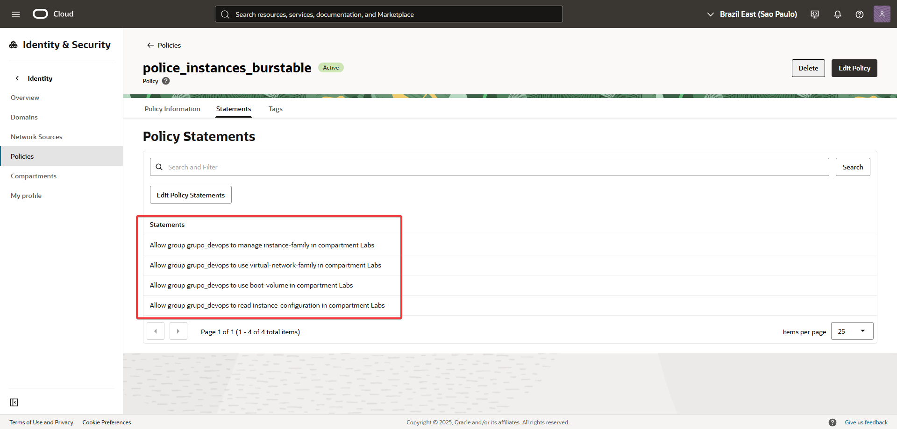
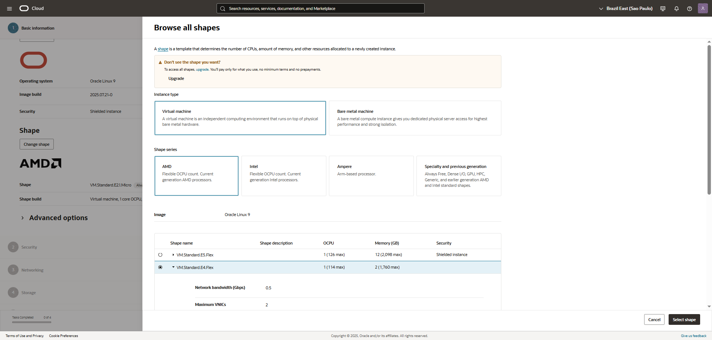
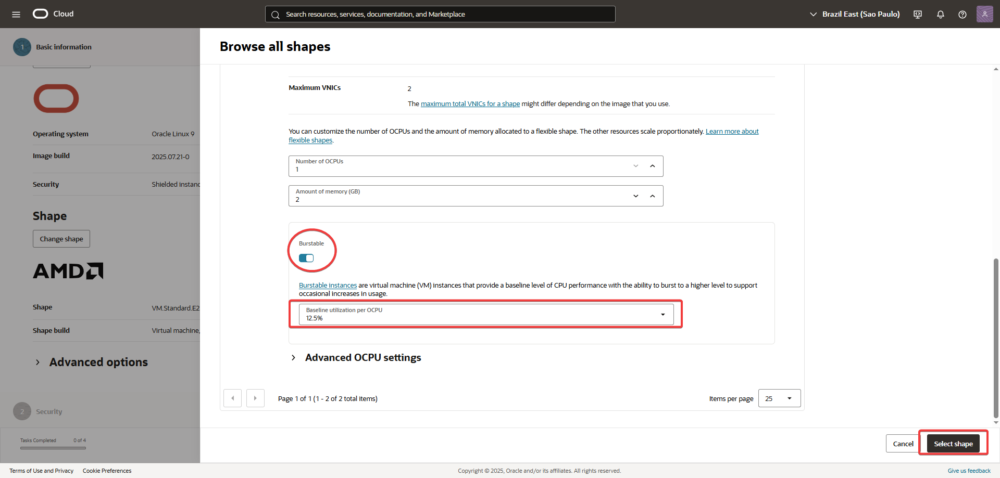
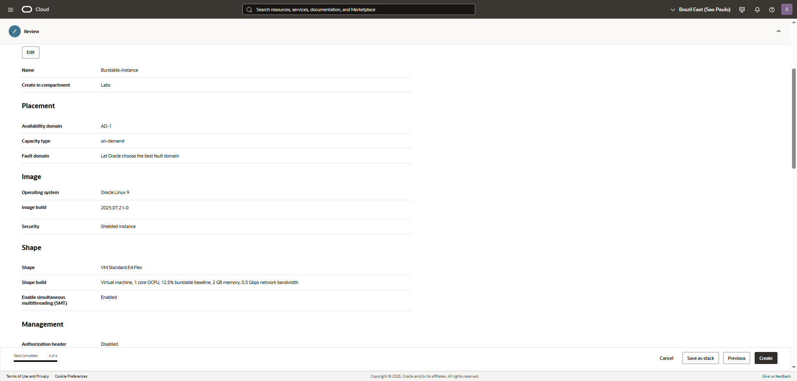
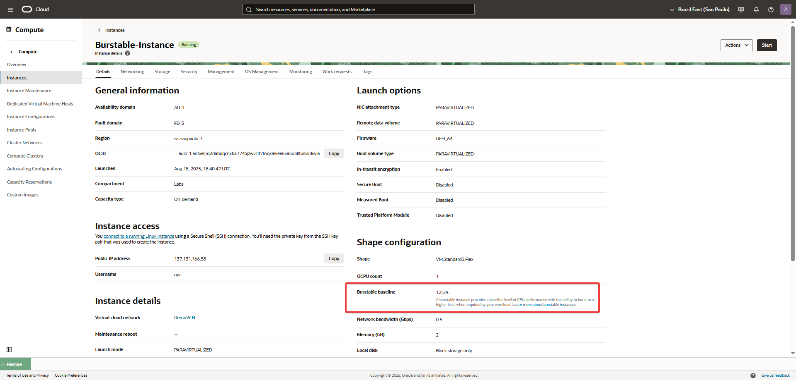

🛠️ Laboratorio: Implementar una Instancia Burstable para Optimizar Costos
Objetivo: Desplegar una instancia de cómputo que pueda manejar los picos de tráfico de forma eficiente y económica, usando un usuario con permisos IAM granulares.
Paso 1: Configurar las Políticas de IAM Granulares
Para que el usuario asignado pueda crear una instancia burstable, necesita permisos sobre varios tipos de recursos de la familia de Compute.

Navega a Identity & Security > Identity > Policies.

Haz clic en "Create Policy".

Dale un nombre a la política (ej. police_Burstable-Instances).

En el cuadro de texto Policy Statements, agrega las siguientes sentencias:

Allow group grupo_devops to manage instance-family in compartment Labs
Allow group grupo_devops to use virtual-network-family in compartment Labs
Allow group grupo_devops to use boot-volume-family in compartment Labs
Allow group grupo_devops to read instance-configuration in compartment Labs
Allow group grupo_devops to use cloud-shell in tenancy

manage instance-family: Permite al usuario crear, actualizar y eliminar instancias.

use virtual-network-family: Permite al usuario adjuntar la instancia a una red virtual (VCN) existente.

use boot-volume-family: Permite al usuario crear el volumen de arranque para la instancia.

read instance-configuration: Permite al usuario ver las plantillas de configuración de instancias, si las hubiera, lo cual es útil en un entorno de desarrollo.tilizan una reserva de capacidad específica (where request.instance.capacityReservation.id = '*'

   

Paso 2: Lanzar la Instancia de la Tienda en Línea
Ahora, con los permisos correctos, el usuario puede lanzar la instancia burstable que servirá como servidor web para la tienda.

Navega a Compute > Instances.

Haz clic en "Create Instance".

Nombre: Burstable-Instance.

Dominio de disponibilidad: Elige un Dominio de Disponibilidad (AD) en tu región.

Forma (Shape):

Haz clic en "Change Shape".

Selecciona la serie VM.Standard.E4.Flex. Esta es una de las formas que soporta el modo burstable.

En la sección de configuración, verás el "Modo de rendimiento". Elige la opción "Burstable".

Esto garantiza que el servidor funcionará con un rendimiento base bajo (ahorrando costos), pero podrá explotar a un nivel de CPU superior cuando el tráfico aumente durante los eventos de venta.
Red (Networking):

Selecciona la VCN y la subred a la que pertenece tu sitio web. Asegúrate de que tenga una dirección IP pública para que los clientes puedan acceder a la tienda.

Lanza la instancia:

Completa el resto del formulario con una imagen de SO adecuada y tu par de claves SSH.

Haz clic en "Create".

   
   
   
   
Paso 3: Verificación y Optimización de Costos
Una vez que la instancia esté en estado Running, puedes verificar que se está ejecutando en el modo correcto.

Detalles de la instancia:

Ve a la página de detalles de tu instancia servidor-web-elbuensabor.

En la sección de información, verifica que el "Modo de rendimiento" está establecido como Burstable.

   
