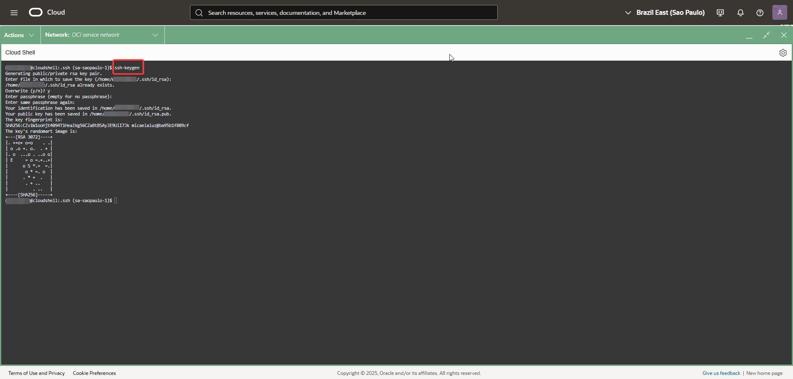
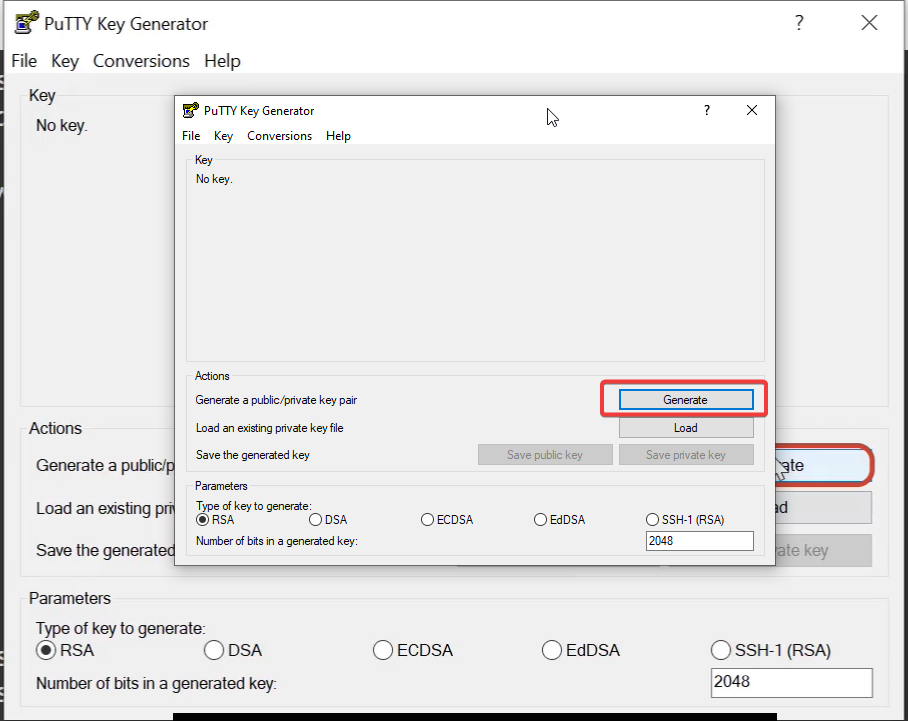
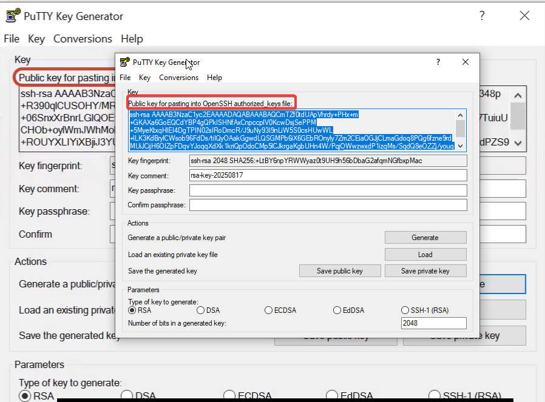
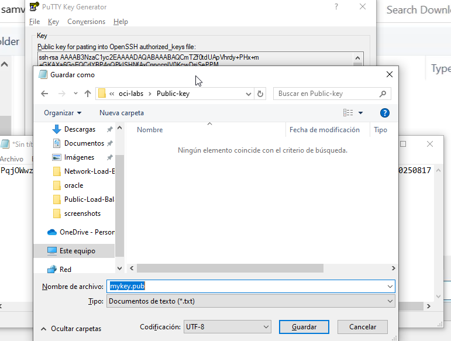
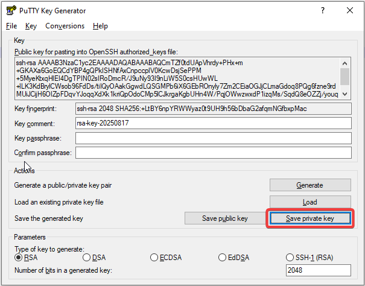
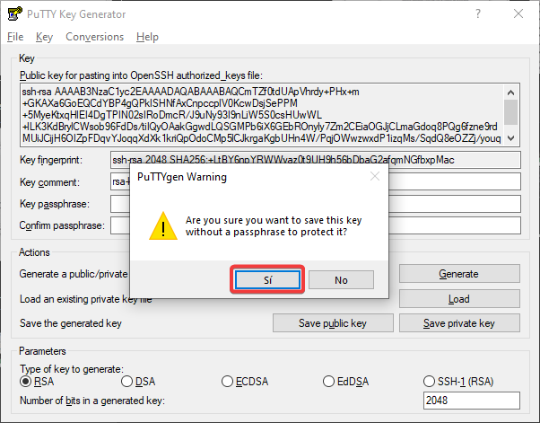

Compute-Generate-SSH-Keypair.md

🛠️ Laboratorio: Generación y Uso de Claves SSH
Objetivo: Generar un par de claves SSH (pública y privada) usando dos métodos diferentes: Cloud Shell y PuTTYgen.

Paso 1: Generar Claves Usando Cloud Shell ☁️
Este método es ideal si solo necesitas una clave rápida para usar con OCI, ya que Cloud Shell se conecta directamente a la nube.

Abre Cloud Shell en la consola de OCI.

Ejecuta el siguiente comando para generar un nuevo par de claves:

ssh-keygen
El sistema te pedirá una ruta para guardar la clave y una frase de contraseña. Para este laboratorio, presiona Enter para usar los valores por defecto.

Después de generar las claves, puedes ver la clave pública con el siguiente comando:

cat ~/.ssh/id_rsa.pub
Guarda el contenido de la clave pública, ya que la necesitarás para lanzar tu instancia.

   
   
Paso 2: Generar Claves Usando PuTTYgen 🔑
PuTTYgen es la herramienta estándar para generar claves SSH en Windows. Es muy útil si planeas conectarte a tus instancias desde tu ordenador local.

Abre el programa PuTTYgen en tu ordenador.

Haz clic en el botón "Generate". Mueve el ratón sobre el área en blanco para que el programa pueda generar la aleatoriedad necesaria para crear la clave.

Una vez que la clave se ha generado, verás la clave pública en el cuadro de texto.

Guarda la clave pública:

Haz clic en "Save public key". Guarda el archivo en un lugar seguro (por ejemplo, en el escritorio). Este archivo tiene una extensión .pub o puedes guardarlo como un archivo de texto.

Guarda la clave privada:

Es crucial que también guardes la clave privada. Haz clic en "Save private key". PuTTYgen te advertirá sobre no tener una frase de contraseña. Haz clic en "Sí" para continuar.

Guarda el archivo con la extensión .ppk. Este archivo es el que usarás para conectarte a tu instancia.

   
   
   
   
   
      
