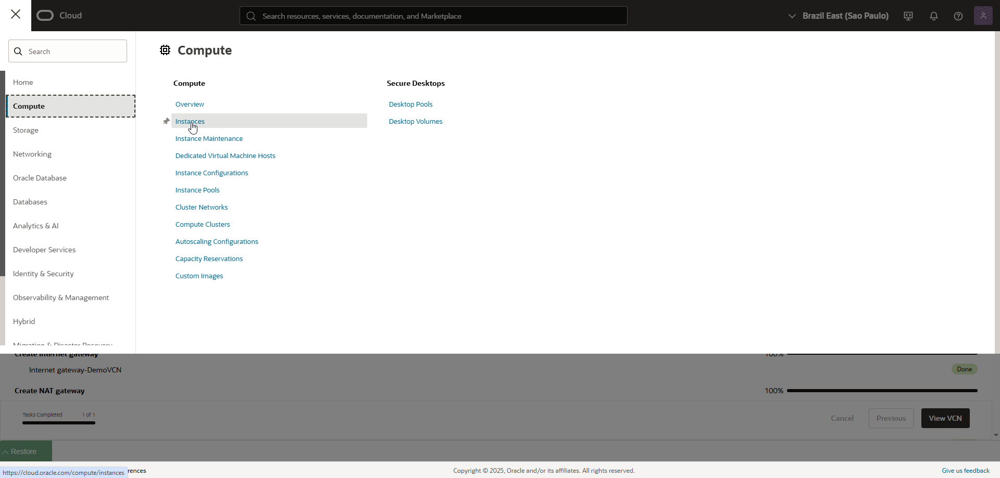
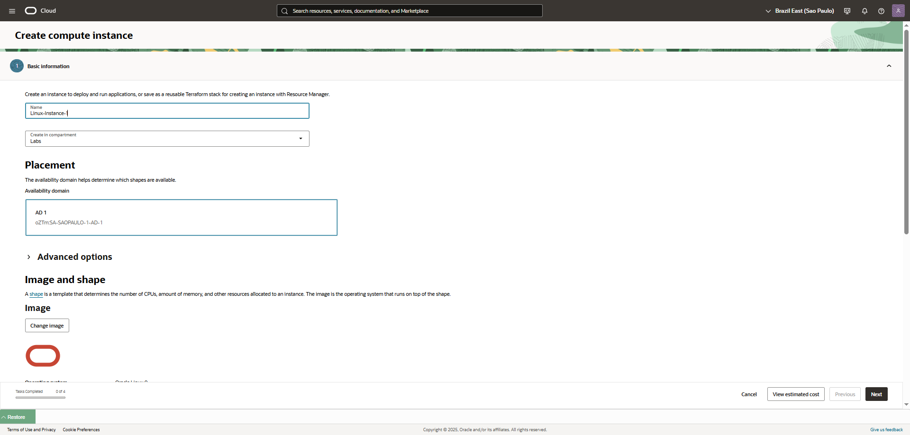
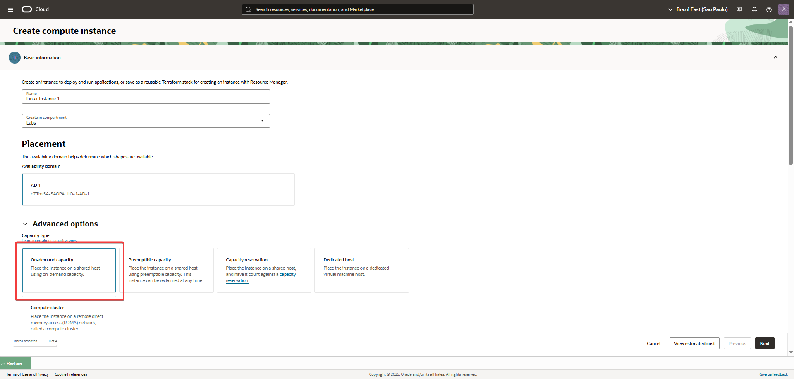
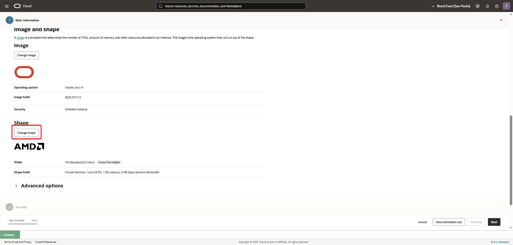
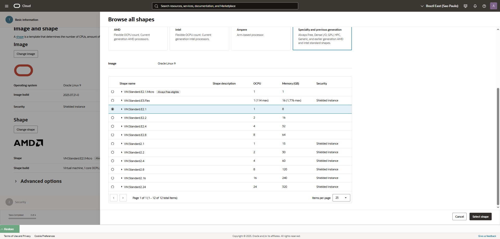
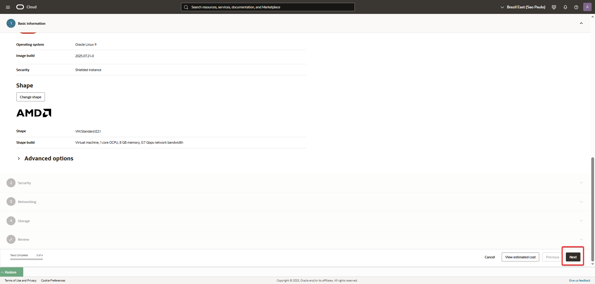
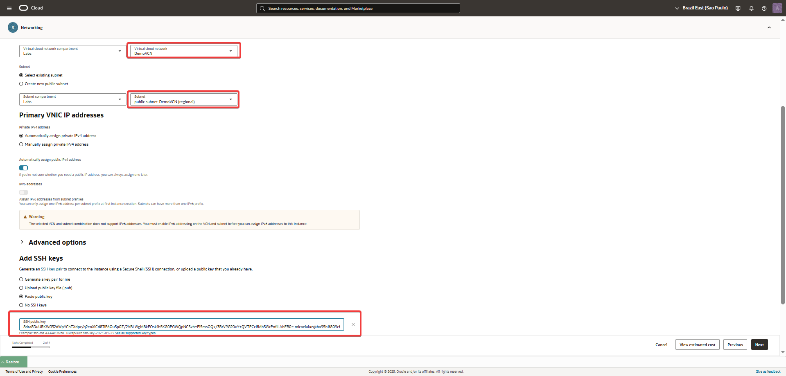
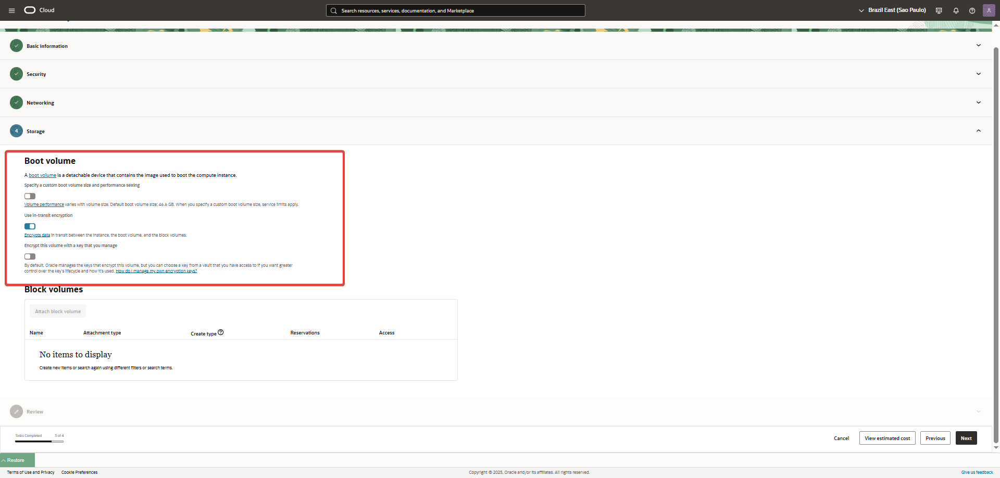
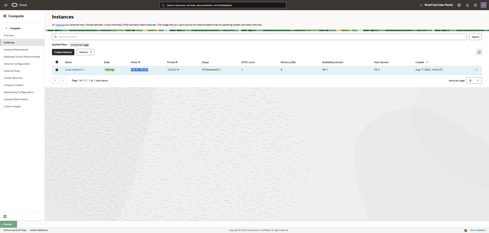
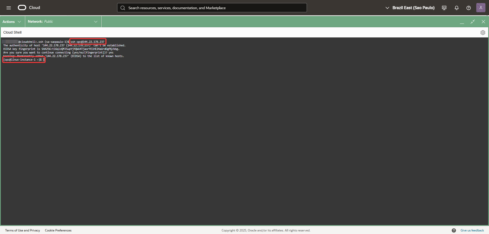

Launch-and-Connect-to-an-Oracle-Linux-Instance.md

🛠️ Laboratorio: Lanzar y Conectarse a una Instancia de Oracle Linux
Objetivo: Crear una instancia de cómputo en OCI con Oracle Linux.

1- Inicia el Asistente de Creación:

Navega a Compute > Instances.

Haz clic en "Create Instance".

2- Configura los Detalles de la Instancia:

Nombre: Dale a tu instancia un nombre descriptivo, como Linux-Instance-1.

Dominio de disponibilidad: Selecciona un Dominio de Disponibilidad (AD) para tu instancia.

Compartimento: Elige el compartimento en el que estás trabajando.

Tipo de capacidad: Para este laboratorio, mantén la opción por defecto On-Demand Capacity.

Imagen y Forma: Elige la imagen de Oracle Linux por defecto. Para optimizar el costo y el rendimiento, selecciona una forma flexible como VM.Standard.E2.1 o VM.Standard.E4.Flex.

3- Configura la Red y la Clave SSH:

Red: Selecciona tu VCN y la subred pública que creaste.

Clave SSH: En la sección "Add SSH Keys", elige "Paste public keys". Pega el contenido de tu clave pública que generaste en el laboratorio anterior.

4- Configura el Volumen de Arranque:

En la sección "Boot Volume", puedes dejar los valores por defecto (normalmente 50 GB) para este laboratorio.

5- Lanza la Instancia:

Haz clic en "Create". La instancia comenzará su proceso de aprovisionamiento.

   
   
   
   
   
   
   
      
         
   
6. Conectarse a la Instancia por Cloud Shell
Una vez que la instancia esté activa, puedes conectarte a ella usando Cloud Shell.

Obtén la IP pública: En la página de detalles de la instancia, copia su IP pública.

Abre Cloud Shell: Haz clic en el icono de Cloud Shell en la esquina superior derecha de la consola de OCI.

   
   
   
