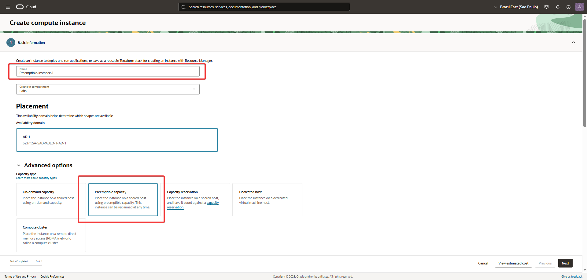
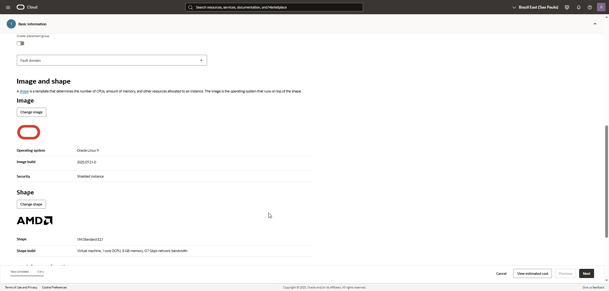
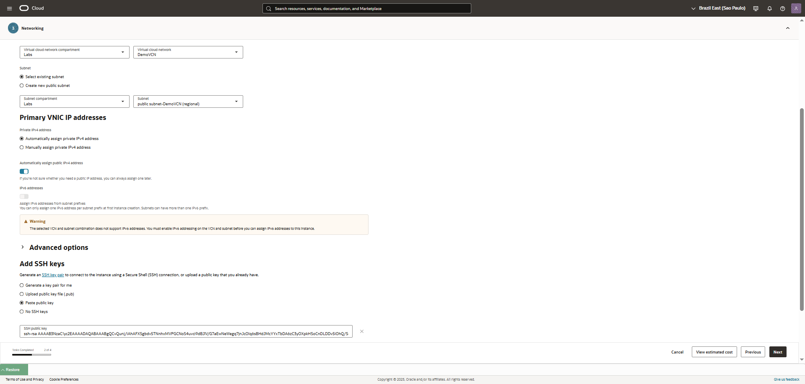
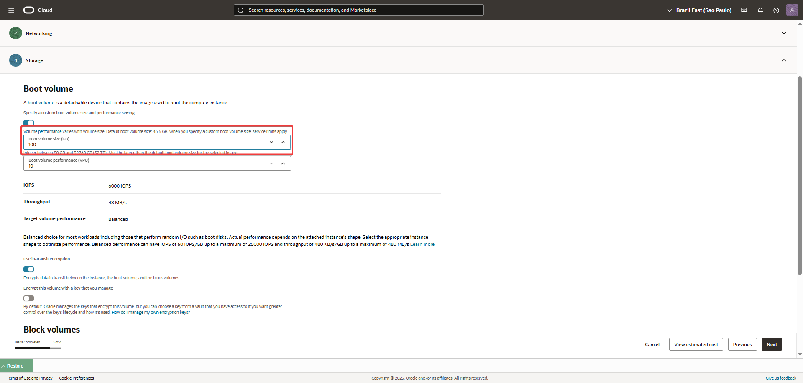
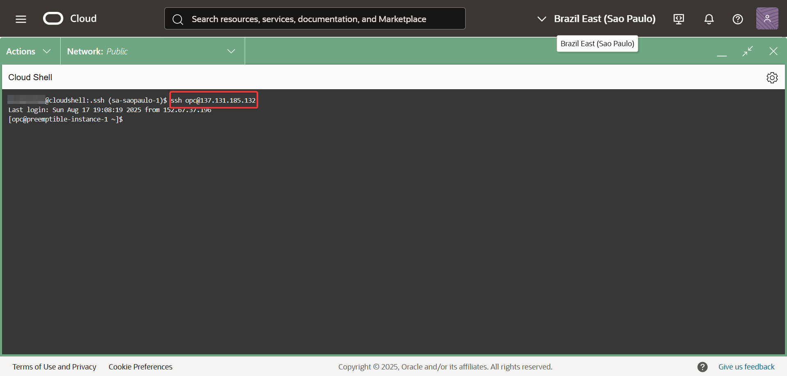

🛠️ Laboratorio: Crear una Instancia de Tipo Preemptible
Objetivo: Crear una instancia de cómputo preemptible en OCI para comprender cómo usar esta opción de bajo costo para cargas de trabajo flexibles.
1. Inicia el Asistente de Creación
Navega a Compute > Instances.

Haz clic en "Create Instance" para iniciar el asistente de creación.

2. Configura los Detalles de la Instancia
Aquí es donde defines la especificación de tu máquina virtual y seleccionas la opción de capacidad preemptible.

Nombre: Dale a tu instancia un nombre descriptivo, como Preemptible-Instance-1.

Dominio de disponibilidad: Selecciona un Dominio de Disponibilidad (AD) para la instancia.

Compartimento: Elige el compartimento en el que estás trabajando.

Tipo de capacidad: Para este laboratorio, selecciona Preemptible Capacity. Esto te permitirá obtener la instancia a un costo significativamente menor, con la advertencia de que OCI la puede detener si la capacidad es necesaria para instancias "On-Demand".

Imagen y Forma: Elige la imagen y forma que se adapten a tus necesidades.

3. Configura la Red y la Clave SSH
Red: Selecciona tu VCN y la subred pública que creaste.

Clave SSH: En la sección "Add SSH Keys", elige "Paste public keys". Pega el contenido de tu clave pública que generaste en el laboratorio anterior.

4. Configura el Volumen de Arranque
En la sección "Boot Volume", puedes dejar los valores por defecto (normalmente 50 GB) para este laboratorio.

5. Lanza la Instancia
Haz clic en "Create". La instancia comenzará su proceso de aprovisionamiento, y su estado pasará a Running en unos minutos.

   
   
   
   
       
   
6. Conectarse a la Instancia por Cloud Shell
Una vez que la instancia esté activa, puedes conectarte a ella usando Cloud Shell.

Obtén la IP pública: En la página de detalles de la instancia, copia su IP pública.

Abre Cloud Shell: Haz clic en el icono de Cloud Shell en la esquina superior derecha de la consola de OCI..

   

