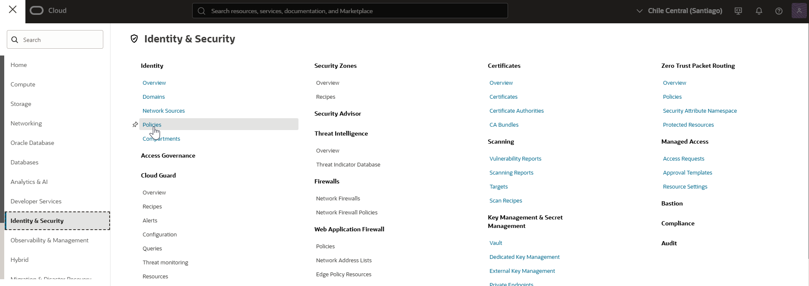
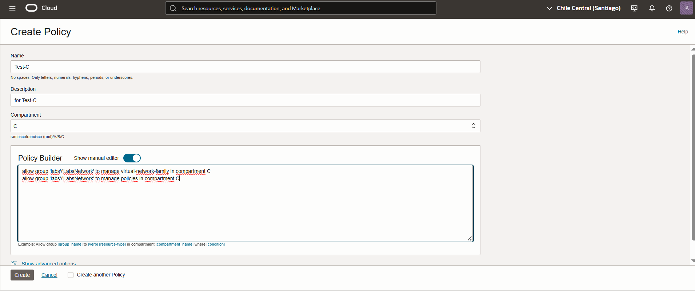
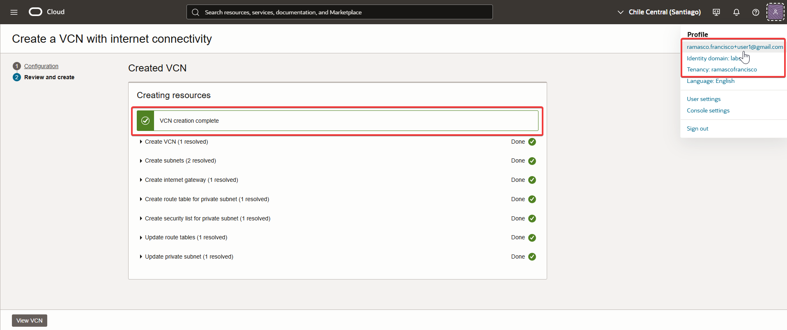
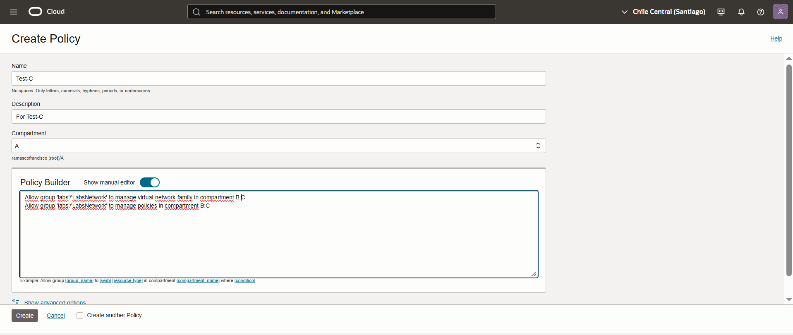
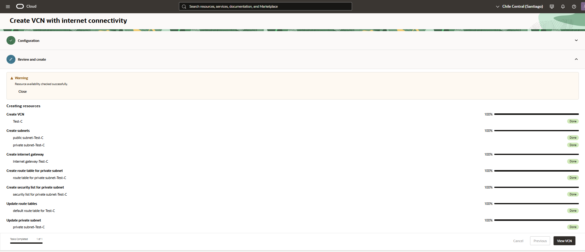

01-Compartment-Inheritance-and-Attachment.md

🔐 Policy Inheritance and Attachment for Compartments
En OCI, las políticas IAM se pueden adjuntar (attach) al tenancy o a un compartimento específico.

🧭 Inheritance (herencia)
Las políticas definidas en un compartimento superior (padre) se aplican a todos sus compartimentos hijos.
No ocurre lo inverso: una política en un compartimento hijo no afecta al padre ni a otros compartimentos hermanos.

🧷 Attachment
Si una política está adjunta al tenancy, puede aplicarse a cualquier compartimento, siempre que la sintaxis lo especifique.
Si está adjunta a un compartimento, solo se aplica dentro de ese compartimento y sus hijos.

🔎 Importante
Las políticas no se suman automáticamente. Es decir, si el usuario necesita permisos en varios compartimentos, debe haber políticas explícitas para cada caso.
Para delegar administración (delegated admin), se combinan políticas a nivel tenancy con políticas en el compartimento delegado.

🧩 Ejercicio
Objetivo: Tenemos 3 compartimentos, A - B y C. 
1-Crear una policiy para que el grupo LabsNetwork pueda gestionar los componentes de Network en el compartimento C.
La policies se debe crear en el compartimento C.

2-Crear una policiy para que el grupo LabsNetwork pueda gestionar los componentes de Network en el compartimento C.
La policies se debe crear en el compartimento A.

---
## 🔍 Paso a paso

1. Ingresé al menú de navegación de Oracle Cloud y seleccioné Identity & Security >  Policies.  
   

2. Hice clic en Create Policiy. Completar el formulario y hacer clic en Create.
	Policies:
	allow group 'labs'/'LabsNetwork' to manage virtual-network-family in compartment C
	allow group 'labs'/'LabsNetwork' to manage policies in compartment C

   

3. Ahora ingresamos con un usuario que pertenezca al grupo LabsNetwork y inicié el proceso de creación de una VCN, completé los datos requeridos y finalicé el asistente. Esto validó que la policy funciona correctamente.
   
   
4. Ahora crear la policy en el compartimento A. 
   Hice clic en Create Policiy. Completar el formulario y hacer clic en Create.
	Policies:
	allow group 'labs'/'LabsNetwork' to manage virtual-network-family in compartment B:C
	allow group 'labs'/'LabsNetwork' to manage policies in compartment B:C
	
   
						
5. Repetir el paso 3.  
   
