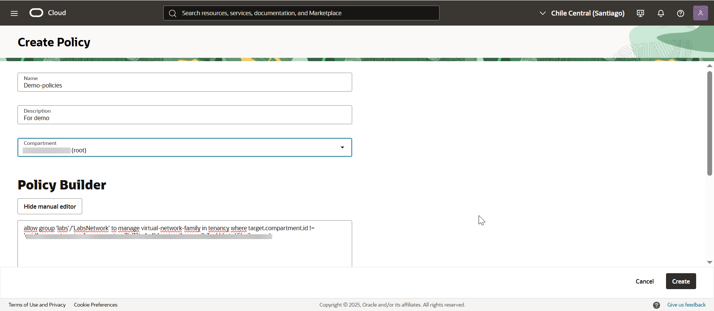
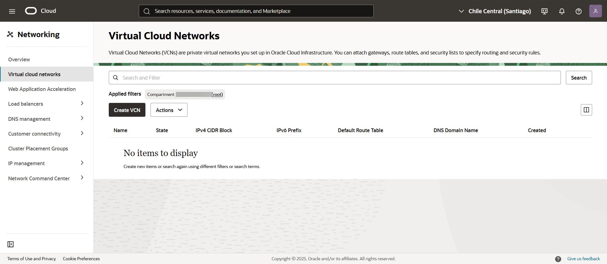
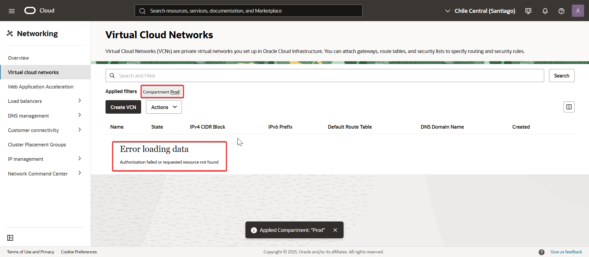

🧩 Ejercicio
Se desea que el grupo DevTeam pueda administrar la red virtual en todo el tenancy, con excepción del compartimento Prod

  
---
## 🔍 Paso a paso

1. Crear la policy en el tenancy para el grupo DevTeam.  
    allow group 'labs'/'LabsNetwork' to manage virtual-network-family in tenancy where target.compartment.id != 'compartimento-ocid'
	
   

2. Ingresar con un usuario miembro del grupo DevTeam y verificar comportamiento.
   En la primera imagen, se accede al compartimento raíz (root/tenancy), donde no hay VCNs creadas, pero no se muestra ningún error de permisos, lo que confirma que el grupo tiene acceso.
   
   En la segunda imagen, al intentar acceder al compartimento Prod, se observa un mensaje de error por falta de autorización, lo cual confirma que la policy se aplicó correctamente.
   
