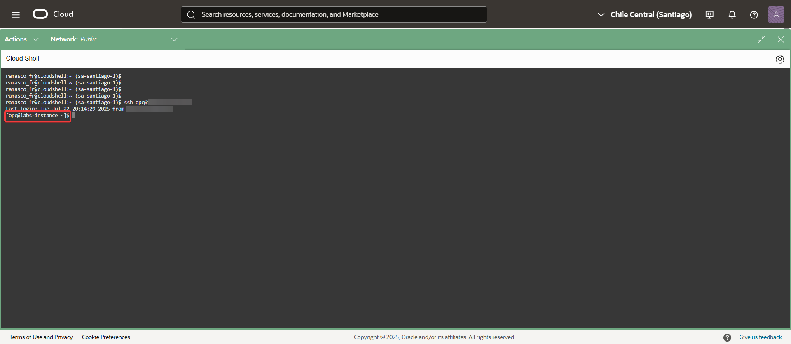
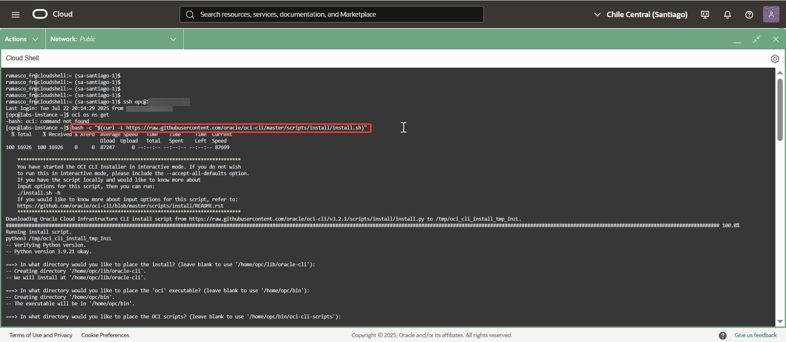
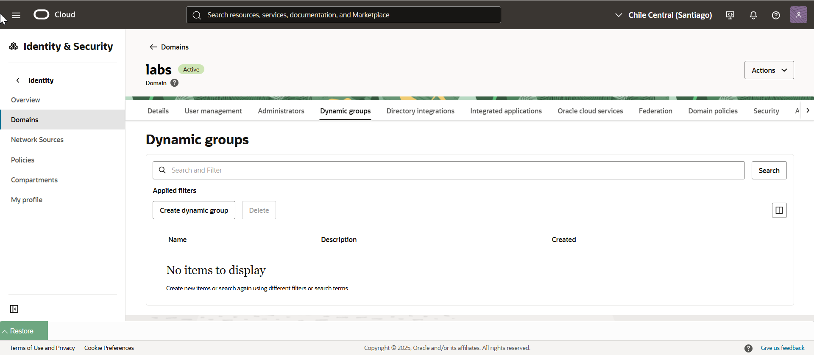
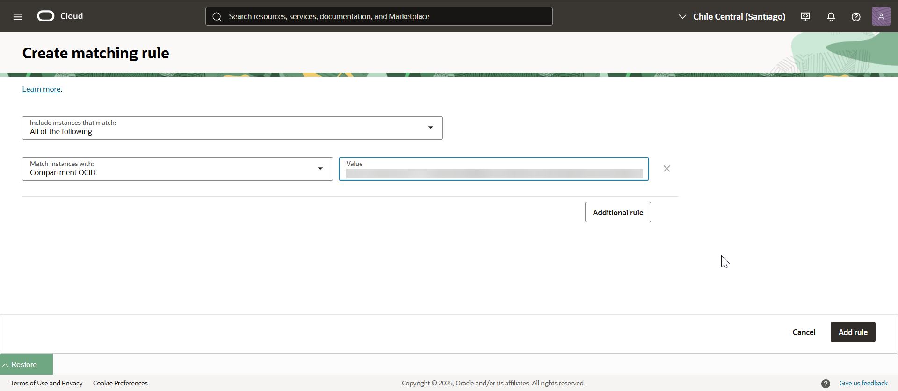
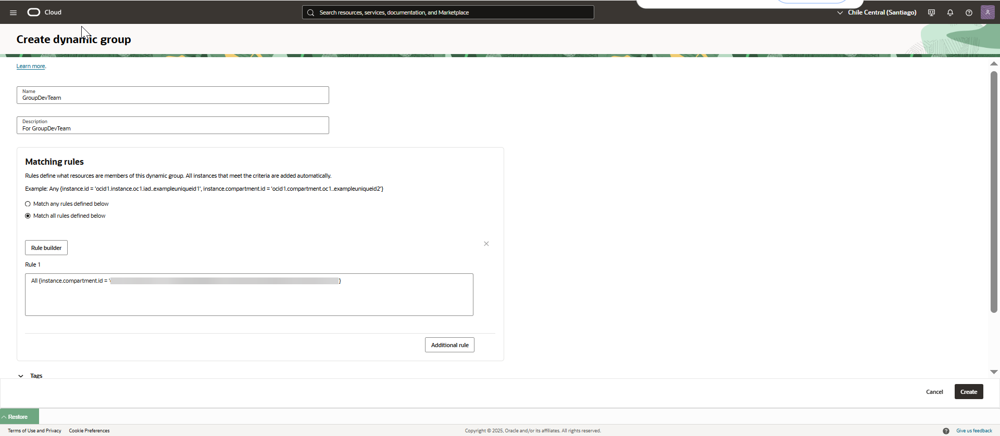
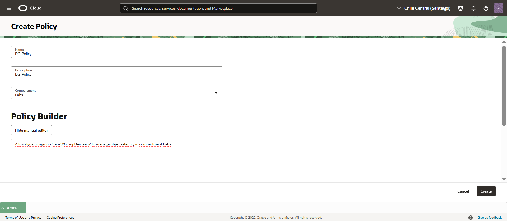
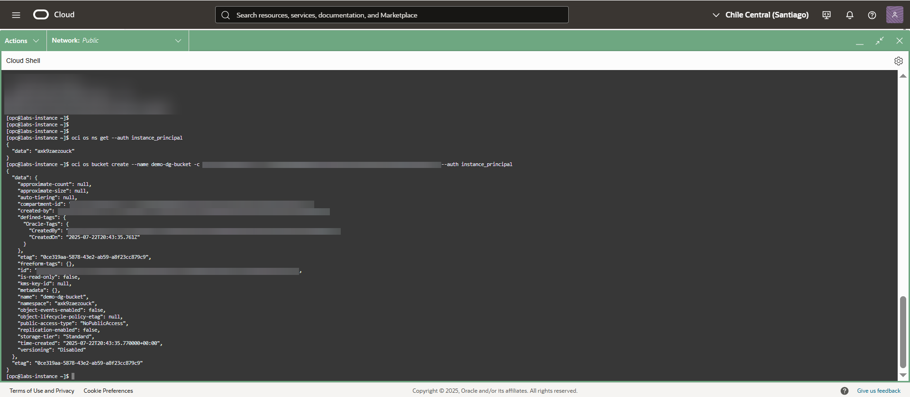
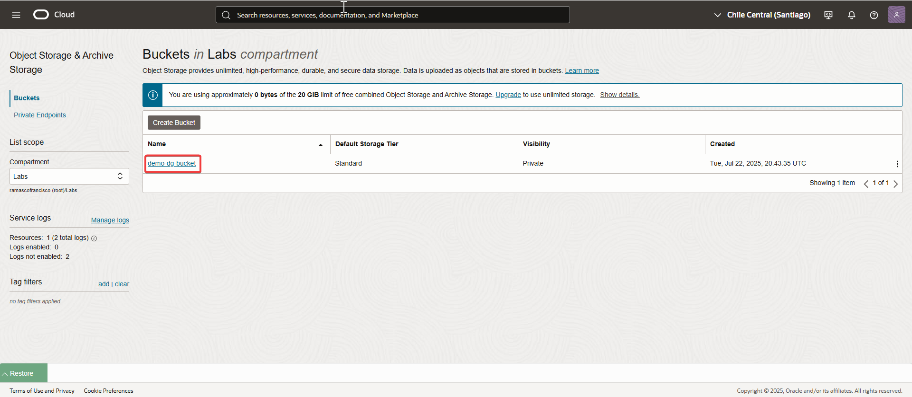

Dynamic-Group.md
🧩 Ejercicio
El objetivo es permitir que el grupo dinámico GroupDevTeam pueda gestionar recursos de Object Storage en el compartimento Labs.

🔧 Pasos previos
A. Crear una VCN en el compartimento Labs, asegurándose de que tenga una IP pública.
B. Crear una instancia en ese mismo compartimento y asociarle la IP pública de la VCN del paso anterior.
C. Confirmar que es posible conectarse a la instancia desde Cloud Shell.

---
## 🔍 Paso a paso

1.  Conectarse por SSH desde Cloud Shell a la instancia creada.
	Policy necesaria:
    allow group 'labs'/'DevTeam' to manage object-family in compartment Labs
	
   

2. Verificar si la instancia tiene el OCI CLI instalado.
Si no lo está, se puede instalar con este comando:
bash -c "$(curl -L https://raw.githubusercontent.com/oracle/oci-cli/master/scripts/install/install.sh)".

   

3. Crear el grupo dinámico GroupDevTeam en el dominio de identidad Labs.

   
   
      
   
4. Crear la política que autoriza al grupo dinámico. 
   
   

5. Probar la configuración intentando crear un bucket desde la instancia.   
   
   
      
