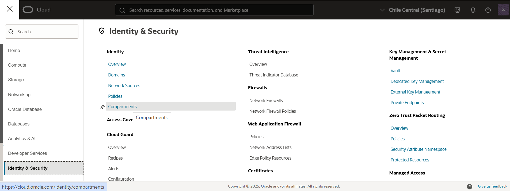
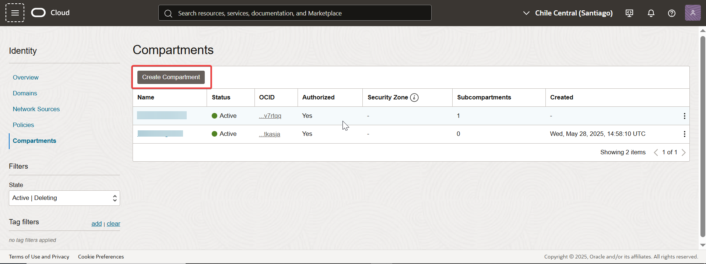
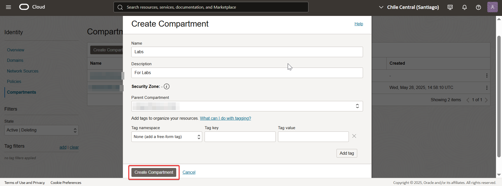
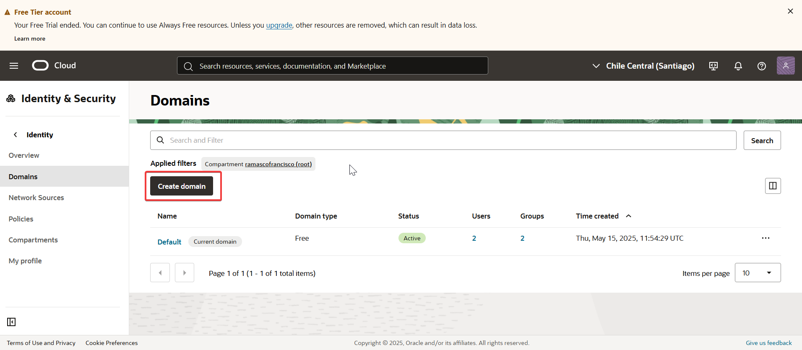
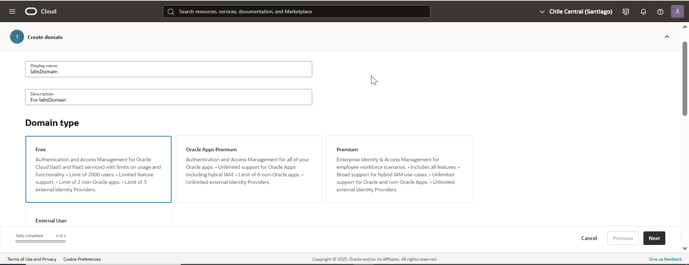
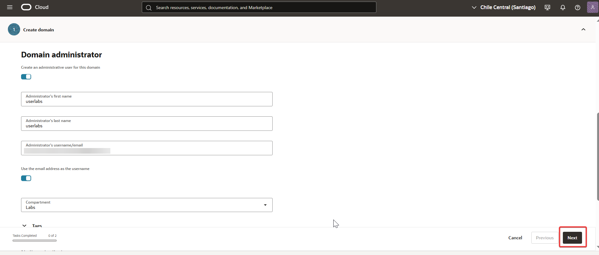
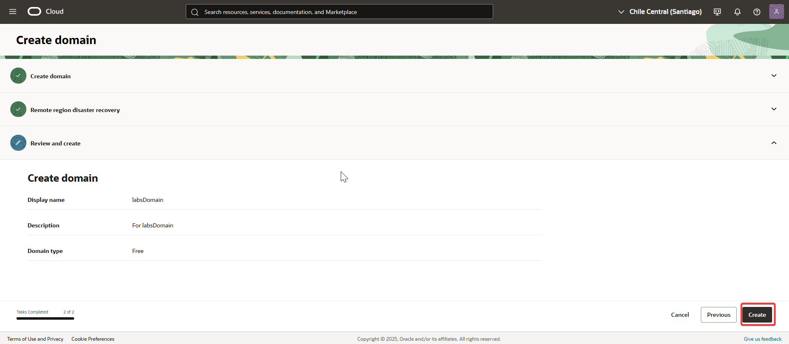

# 02 - Crear un nuevo dominio de identidad

✔️ Actividad: Crear un nuevo dominio de identidad.

🧠 Teoría:  
Un dominio es una partición de identidad separada dentro de OCI, útil para segregar ambientes, equipos o aplicaciones.

---

## 🔍 Paso a paso

1. Ingresé al menú de navegación de Oracle Cloud y seleccioné **Identity & Security > Compartments**.  
   

2. Hice clic en **Create Compartment** para crear un compartimento nuevo.  
   

3. Completé el formulario con los datos del compartimento y confirmé con **Create Compartment**.  
   

4. Navegué a la sección **Domains** dentro del menú de navegación.  
   

5. Hice clic en **Create Domain** para iniciar la creación del nuevo dominio.  
   

6. Ingresé el nombre del dominio, seleccioné el tipo adecuado para mis necesidades y luego hice clic en **Next**.  
   

7. Ingresé los datos del usuario administrador para el dominio y confirmé con **Create Domain**.  
   

