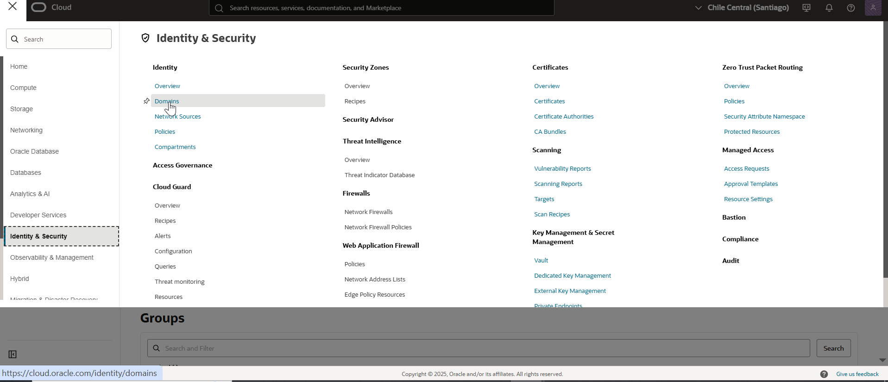
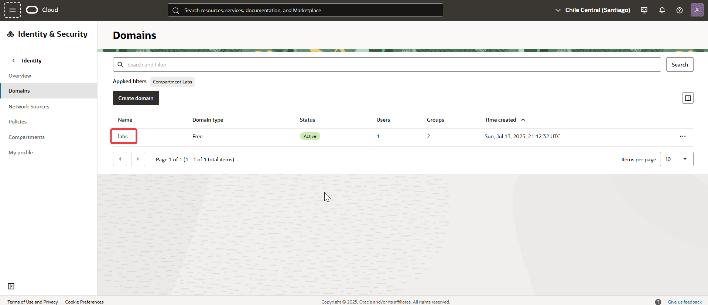
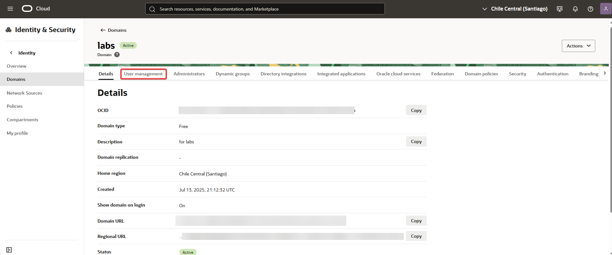
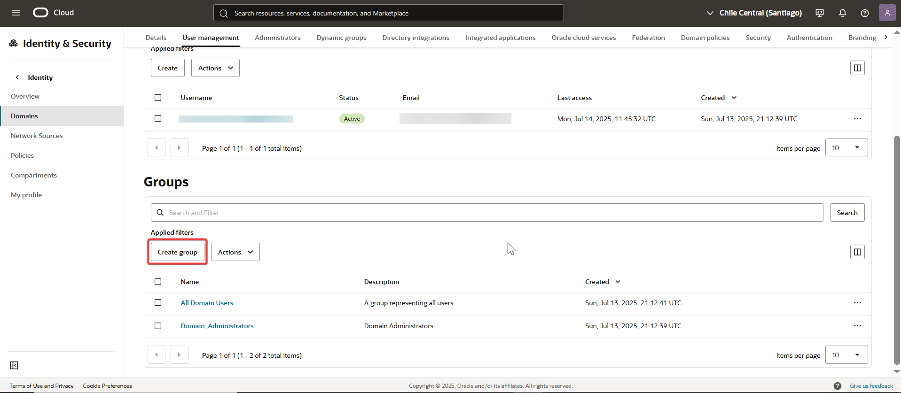
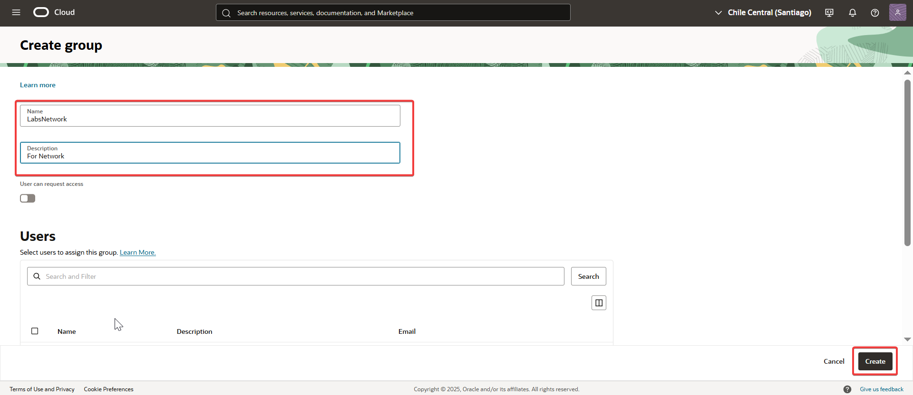

# 03 - Managing Groups

✔️ Actividad: Crear un grupo en el dominio "Labs", utilizando el usuario creado en el ejercicio anterior.

🧠 Teoría:
Los **grupos** en OCI permiten organizar usuarios con roles y permisos similares, facilitando la gestión mediante políticas de seguridad compartidas.

---

## 🔍 Paso a paso

1. Ingresé al menú de navegación de Oracle Cloud y seleccioné **Identity & Security > Domains**.  
   

2. Hice clic sobre el dominio **Labs** para acceder a su configuración.  
   

3. Dentro del dominio, accedí a la solapa **User Management**.  
   

4. Seleccioné la opción **Groups** en el menú lateral y luego hice clic en **Create Group**.  
   

5. Completé el formulario con el nombre y descripción del grupo, revisé la información y confirmé con **Create Group**.  
   
