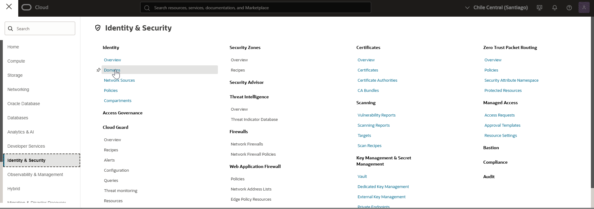
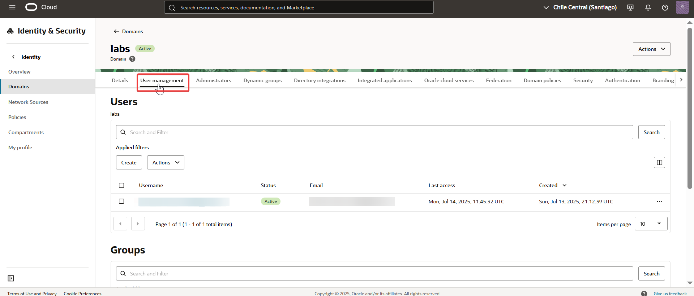
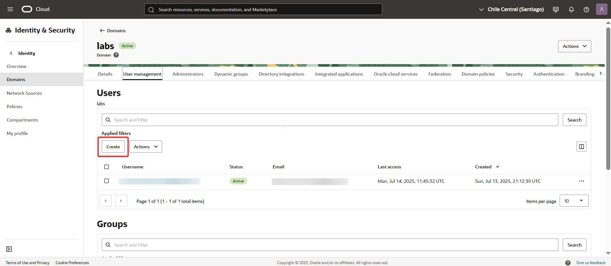
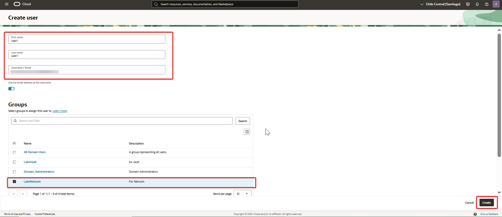

# 04 - Managing Users

✔️ Actividad: Crear un nuevo usuario en el dominio "Labs" y agregarlo al grupo "LabsNetwork".

🧠 Teoría:  
En OCI, los usuarios representan identidades individuales con acceso a recursos. Se los puede agrupar y administrar mediante políticas. Cada usuario tiene credenciales y preferencias propias, y puede formar parte de uno o varios grupos.

---

## 🔍 Paso a paso

1. Ingresé al menú de navegación de Oracle Cloud y seleccioné **Identity & Security > Domains**.  
   

2. Hice clic en el dominio **Labs** y accedí a la solapa **User Management**.  
   

3. Seleccioné la opción **Users** en el menú lateral y luego hice clic en **Create**.  
   

4. Completé el formulario con los datos del nuevo usuario, revisé la información y confirmé con **Create User**.  
   

