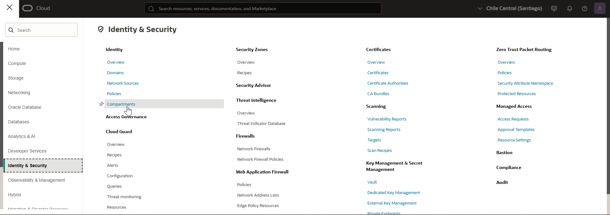
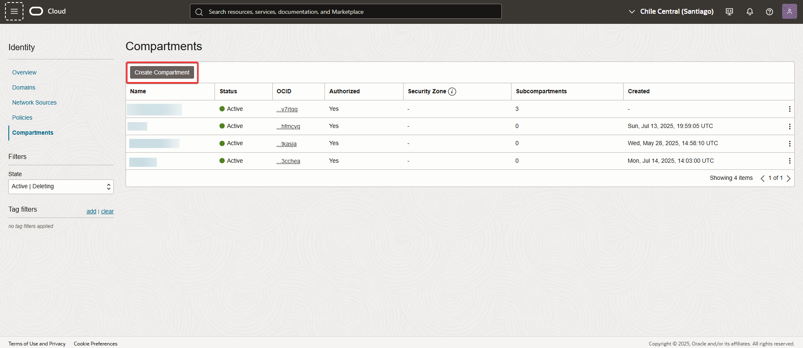
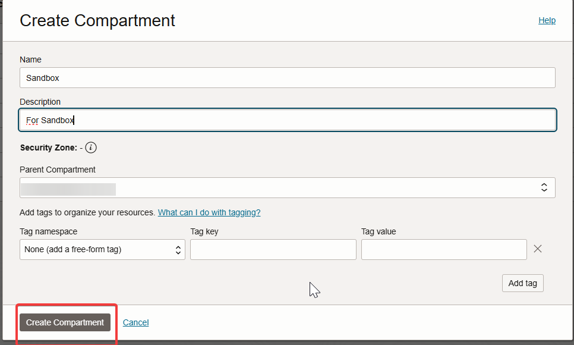
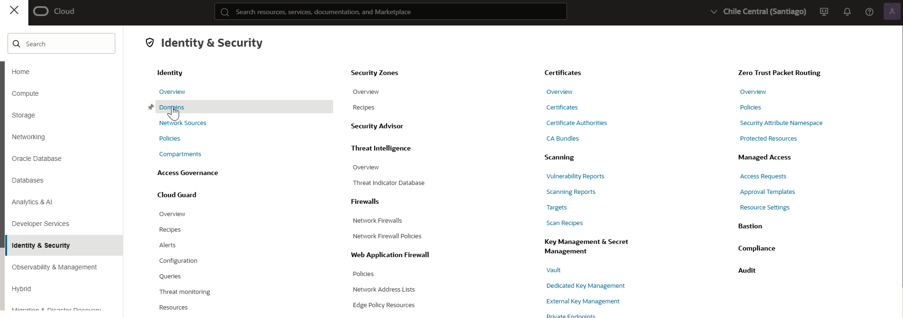
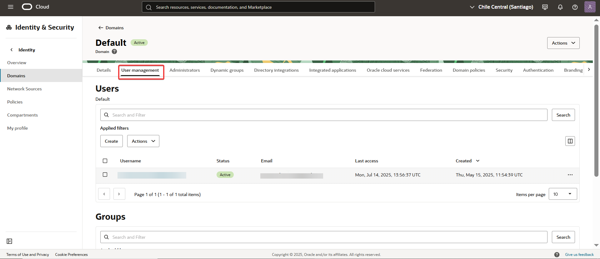
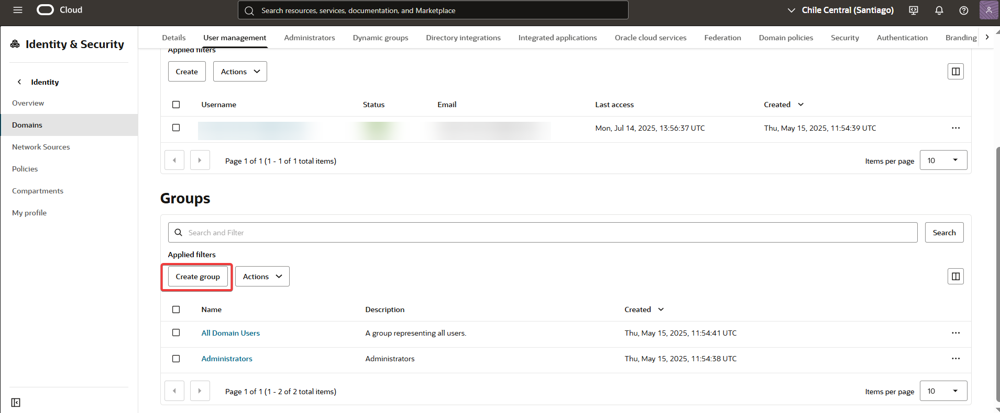
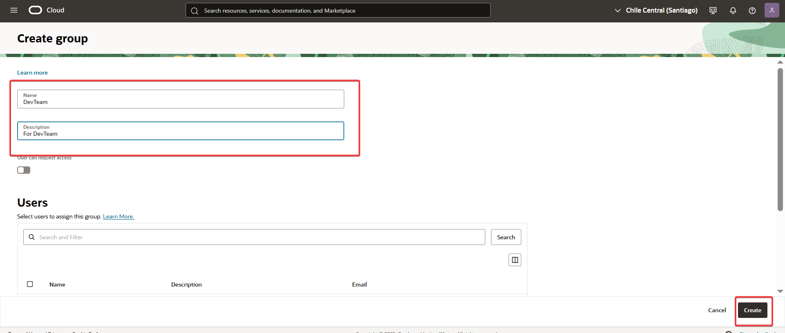
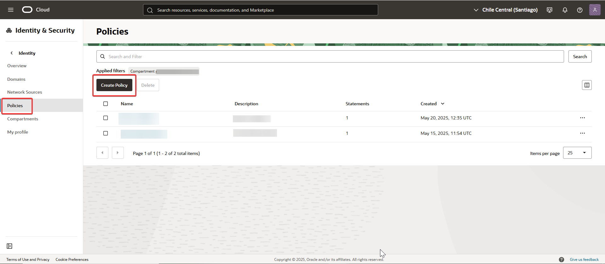
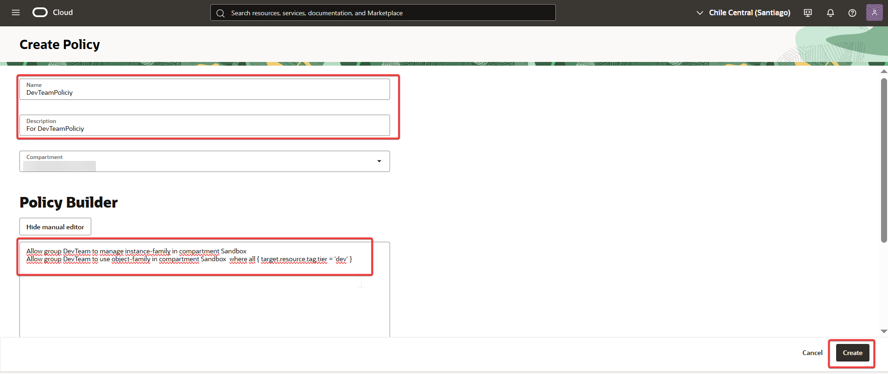

# 05. IAM-And-Policies 
Caso:
Querés permitir que un grupo llamado DevTeam:

Cree instancias de compute en el compartimento Sandbox

Use Object Storage solo si el recurso tiene el tag tier=dev

Policies necesarias:
Allow group DevTeam to manage instance-family in compartment Sandbox
Allow group DevTeam to use object-family in compartment Sandbox 
  where all { target.resource.tag.tier = 'dev' }

---
## 🔍 Paso a paso 

1. Ingresé al menú de navegación de Oracle Cloud y seleccioné Identity & Security > Compartments.  
   

2. Hice clic en Create Compartment..  
      

3. Completé el formulario con los datos del compartimento y confirmé con Create Compartment.
       
   
4. Navegué a Identity & Security > Domains para gestionar el dominio.
   
   
5. Ingresé al dominio correspondiente y accedí a la solapa User Management.
      
   
6. Seleccioné Groups y luego hice clic en Create Group.
     

7. Completé el formulario del grupo DevTeam y confirmé con Create.
        
   
8. Luego accedí a la solapa Policies del dominio y seleccioné Create Policy.
    

9. Completé el formulario y escribí manualmente las políticas necesarias, luego confirmé con Create.
       
