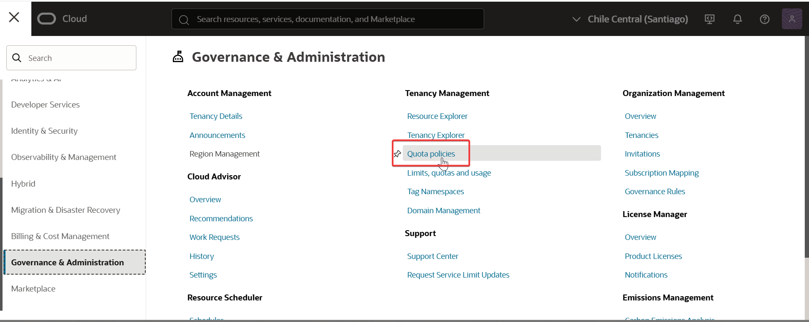
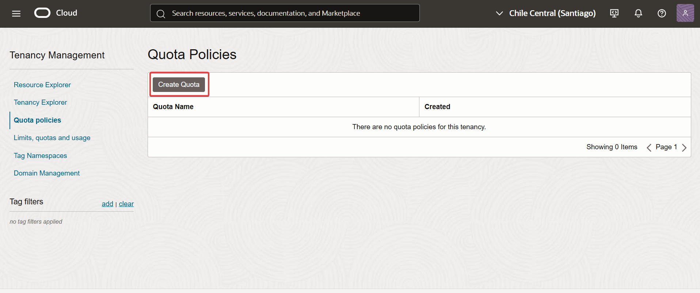
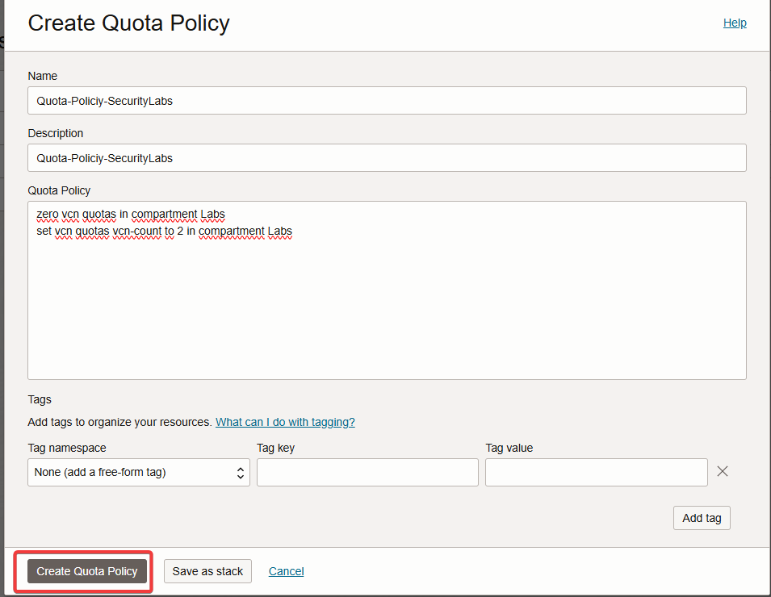
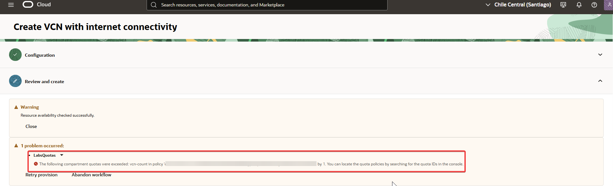

07-Compartment-Quotas.md

📌 ¿Qué son?
Compartment Quotas te permiten restringir el uso de recursos dentro de un compartimento, de manera más granular que los límites de tenancy.
Se usan para controlar cuánto y qué tipo de recursos pueden usar los usuarios en un compartimento específico.

✅ Importante: Solo aplican dentro de un compartimento específico, y NO afectan a otros compartimentos.

🎯 ¿Para qué se usan?
Evitar el uso excesivo de recursos por parte de equipos o entornos (ej.: entornos de prueba).
Aplicar políticas internas de consumo o presupuesto.
Dividir recursos de forma controlada entre varios equipos dentro del tenancy.

🔐 ¿Quién puede crearlas?
Solo un administrador de tenancy (usuario con permisos manage quota a nivel tenancy).
Se aplican usando el servicio Quotas y una sintaxis específica.

Ejemplo:
set compute quota vm-standard2.1 count = 2
set block-volume quota total-size-gbs = 100
set load-balancer quota count = 0

📎 Consideraciones para el examen
Las quotas complementan las IAM Policies (no las reemplazan)
Solo aplican en el compartimento donde se definen
Si se excede una quota, se lanza el error: "Quota exceeded"
Se pueden combinar quotas por shape, CPU, cantidad, etc.

🧩 Ejercicio
Objetivo: Restringir la creación de VCN en el compartimento Labs.

---
## 🔍 Paso a paso

1. Ingresé al menú de navegación de Oracle Cloud y seleccioné Governance & Administration > Quota Policies.  
   

2. Hice clic en Create Quota. Completar el formulario y hacer clic en Create.
	Quota Policy:
	zero vcn quotas in compartment Labs
	set vcn quotas vcn-count to 0 in compartment Labs
   

3. Intentar crear una VCN, si no lo permite, la Quota se creo correctamente.
   
   
