🛠️ Laboratorio de Private Load Balancer con IAM
Objetivo: Configurar un Balanceador de Carga Privado para distribuir tráfico entre dos instancias, usando un usuario con permisos IAM específicos.
Paso 1: Configuración de IAM (Reutilizar)
Puedes reutilizar el mismo usuario y grupo del laboratorio anterior, ya que las políticas que creaste ya otorgan los permisos necesarios para gestionar balanceadores de carga y redes virtuales.

Grupo: grupo_devops

Usuario: lb_admin

Política: politica_lb_devops

Allow group grupo_devops to manage instance-family in compartment <nombre_de_tu_compartimento>

Allow group grupo_devops to manage virtual-network-family in compartment <nombre_de_tu_compartimento>

Allow group grupo_devops to manage load-balancers in compartment <nombre_de_tu_compartimento>

   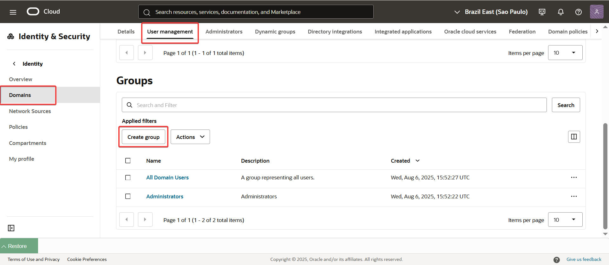
   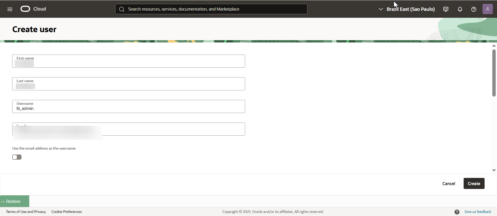
   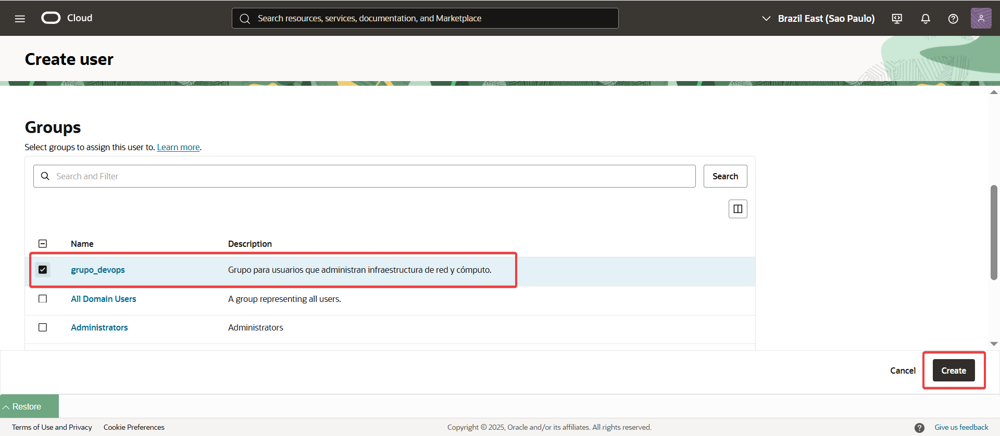
   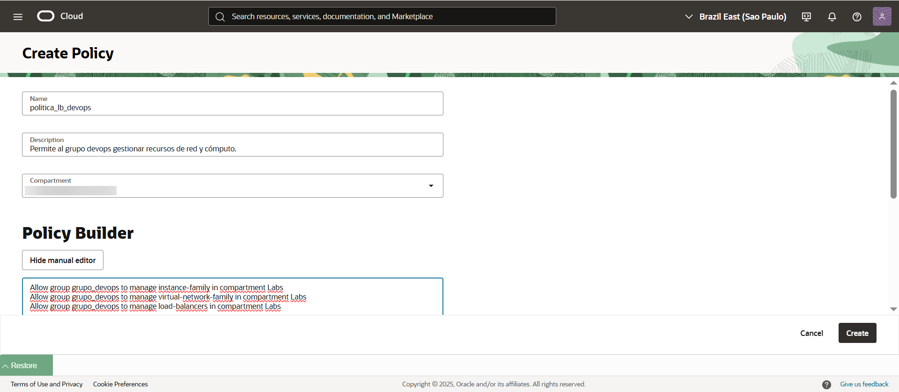   

Paso 2: Preparar la Infraestructura
La diferencia principal aquí es que usaremos subredes privadas para las instancias y el balanceador de carga.

Crea la VCN y Subredes Privadas:

Navega a Networking > Virtual Cloud Networks.

Crea una VCN llamada VCN-LB-Privado (CIDR 10.0.0.0/16).

Crea dos subredes privadas:

Subnet-LB-Privada-1: CIDR 10.0.1.0/24.

Subnet-LB-Privada-2: CIDR 10.0.2.0/24.

Lanza y configura las Instancias de Cómputo (Backend Servers):

Lanza dos instancias de cómputo en diferentes subredes privadas:

Instancia 1: priv-web-server-1 en Subnet-LB-Privada-1.

Instancia 2: priv-web-server-2 en Subnet-LB-Privada-2.

Conéctate a cada instancia vía SSH (usando Cloud Shell o una bastion host).

Instala Nginx en cada una y configura un mensaje único.

IMPORTANTE: Deben tener configurado un NAT Gateway para poder conectar con internet y descargar los paquetes.

En priv-web-server-1:
sudo yum install -y nginx
sudo systemctl start nginx
sudo systemctl enable nginx
echo '<h1>Hola desde el Servidor Privado 1!</h1>' | sudo tee /usr/share/nginx/html/index.html

En priv-web-server-2:
sudo yum install -y nginx
sudo systemctl start nginx
sudo systemctl enable nginx
echo '<h1>Hola desde el Servidor Privado 2!</h1>' | sudo tee /usr/share/nginx/html/index.html

   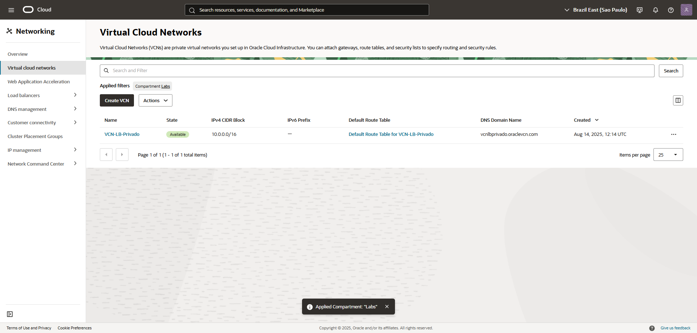
   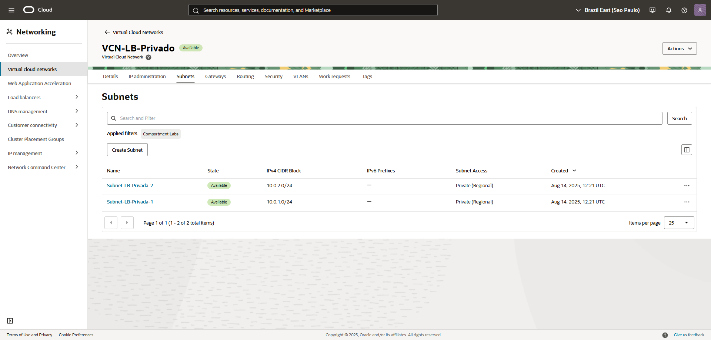
   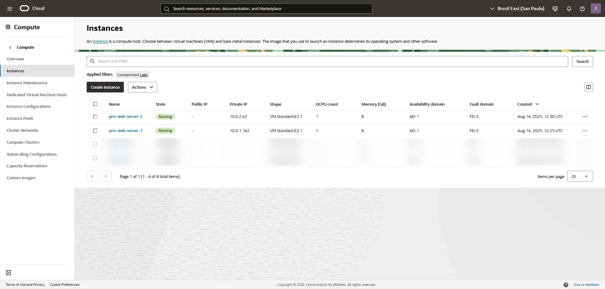
   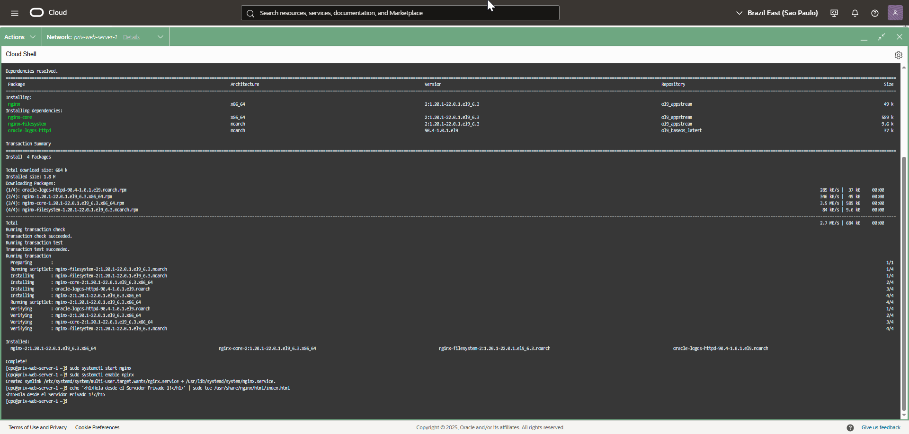  
   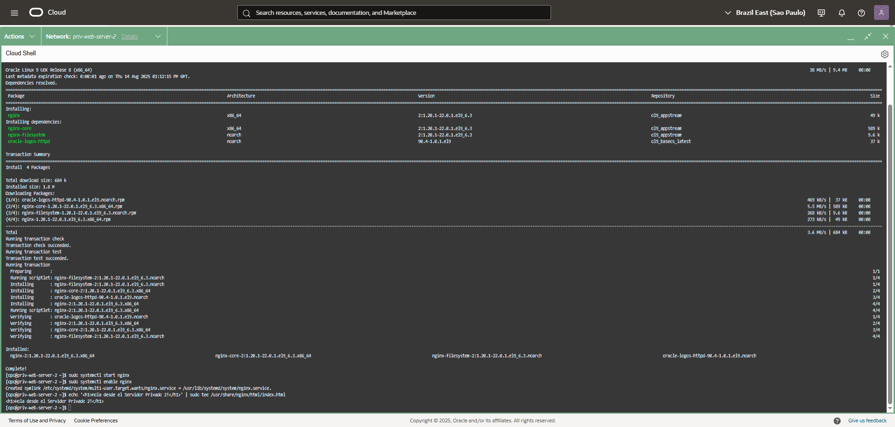  
   
Paso 3: Crear el Balanceador de Carga Privado
Crea el Balanceador de Carga Privado:

Navega a Networking > Load Balancers.

Haz clic en "Create Load Balancer".

Nombre: lb-privado.

Tipo: Private Load Balancer.

Forma: Micro.

Red de la VCN: Selecciona VCN-LB-Privado.

Subred: Aquí, selecciona solo una de las subredes privadas. Por ejemplo, Subnet-LB-Privada-1.

Configura el Backend Set y los Servidores:

En la sección "Choose backends", haz clic en "Add Backends".

Selecciona las dos instancias (priv-web-server-1 y priv-web-server-2) y el puerto 80.

En "Specify Health Check Policy", configura:

Protocol: HTTP

Port: 80

Configura el Listener:

Deja la configuración por defecto para el puerto 80 (HTTP).

Finaliza la creación: Haz clic en "Submit" y espera a que el balanceador de carga esté activo.

IMPORTANTE: Desactivar Firewalld

   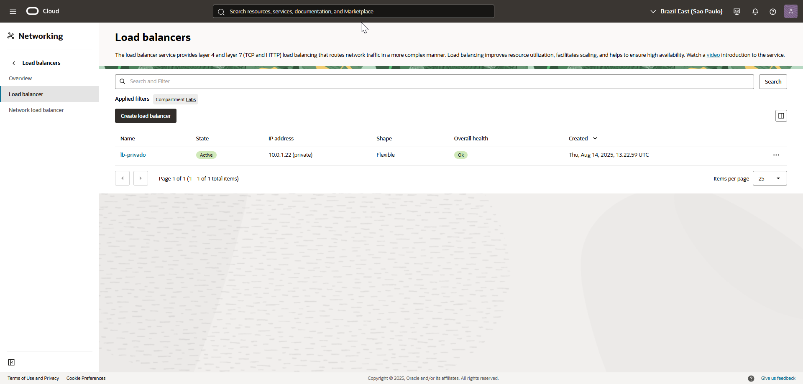
   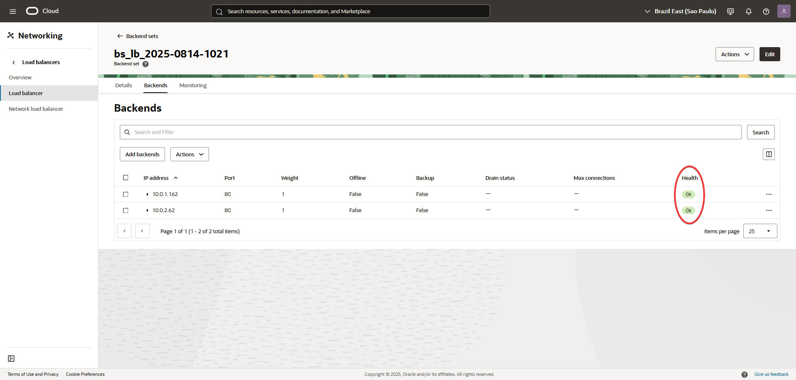   
   
Paso 4: Verificación
A diferencia del balanceador público, no puedes acceder a este balanceador desde internet. La única forma de probarlo es desde una instancia dentro de la misma VCN.

Obtén la IP Privada del Load Balancer:

En la página de detalles de tu balanceador, anota la IP Privada que se le ha asignado.

Prueba la conexión desde una instancia:

Conéctate por SSH a una de tus instancias (por ejemplo, priv-web-server-1).

Desde la línea de comandos de la instancia, usa curl para probar la conexión a la IP privada del balanceador:

curl http://10.0.1.22

IMPORTANTE: Confirmar que en la security list asociadas a las subnets privadas tengan una regla de ingreso para ambas subnets, para el puerto 80.

Si el balanceador está funcionando, verás el mensaje "Hola desde el Servidor Privado 2!" (o el mensaje del servidor 1). Si repites el comando varias veces, verás cómo alterna entre los dos servidores.   

   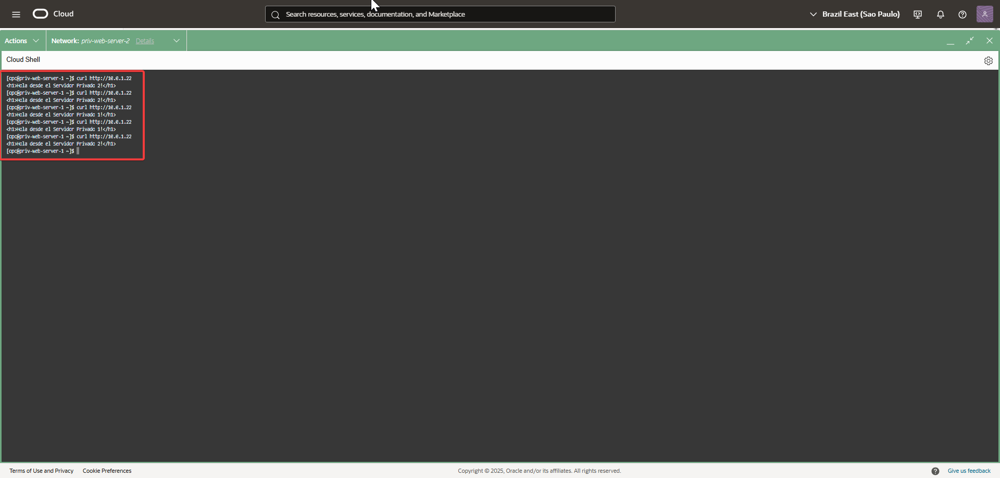
   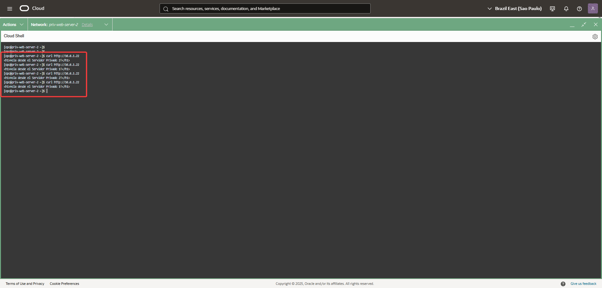  
