🛠️ Laboratorio de Public Load Balancer con IAM
Objetivo: Configurar un Balanceador de Carga Público que distribuya el tráfico entre dos instancias, usando un usuario con permisos limitados a través de políticas de IAM.
Paso 1: Configuración de IAM (Identity and Access Management)
En este paso, crearás un grupo y un usuario con permisos específicos para trabajar con servicios de red y cómputo.

Crea el Grupo de Usuarios:

En la consola de OCI, navega a Identity & Security > Identity > Groups.

Haz clic en "Create Group".

Nombre: grupo_devops

Descripción: Grupo para usuarios que administran infraestructura de red y cómputo.

Crea el Usuario:

Navega a Identity & Security > Identity > Users.

Haz clic en "Create User".

Nombre de Usuario: lb_admin

Descripción: Usuario para administrar el Balanceador de Carga.

Después de crearlo, haz clic en el usuario lb_admin y en "Add to Group" para agregarlo al grupo grupo_devops.

   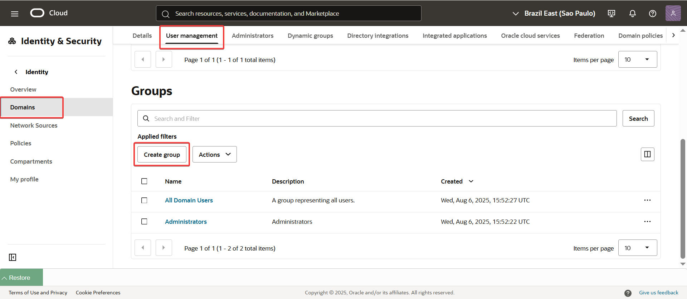
   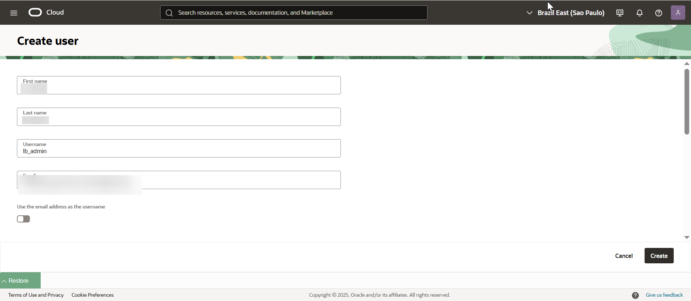
   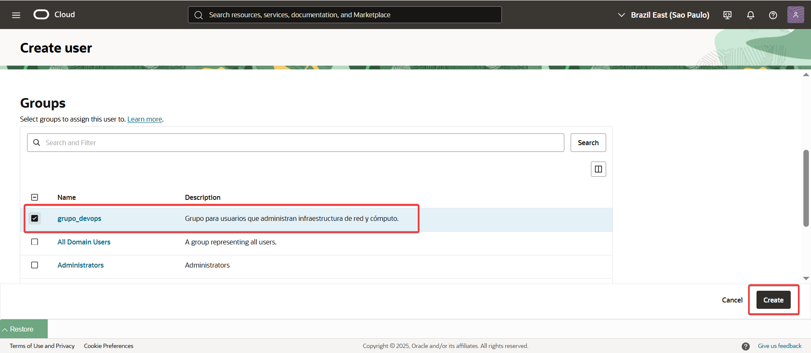

Crea la Política de IAM:

Navega a Identity & Security > Identity > Policies.

Haz clic en "Create Policy".

Nombre: politica_lb_devops

Descripción: Permite al grupo devops gestionar recursos de red y cómputo.

En el campo "Policy Statements", agrega las siguientes líneas. Estas sentencias otorgan permisos para crear y gestionar instancias, VCNs y balanceadores de carga en tu compartimento:

Allow group grupo_devops to manage instance-family in compartment Labs
Allow group grupo_devops to manage virtual-network-family in compartment Labs
Allow group grupo_devops to manage load-balancers in compartment Labs  

   
   
Paso 2: Preparar la Infraestructura
Ahora, con las políticas configuradas, te loguearás como el usuario lb_admin para crear los siguientes componentes.

Crea la VCN y Subredes:

Navega a Networking > Virtual Cloud Networks.

Crea una VCN llamada VCN-LB con el bloque CIDR 10.0.0.0/16.

Crea dos subredes públicas:

Subnet-LB-Publica-1: CIDR 10.0.1.0/24

Subnet-LB-Publica-2: CIDR 10.0.2.0/24   

   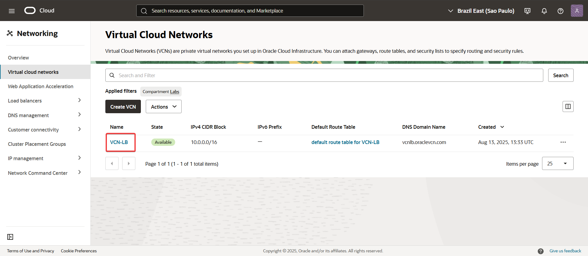
   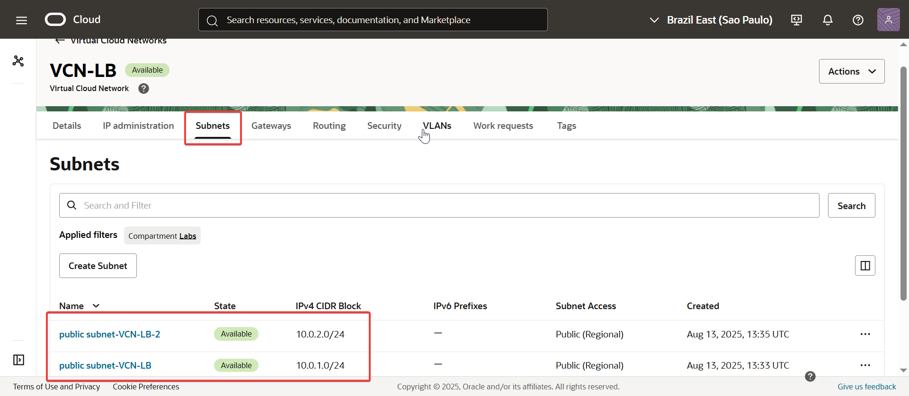

Lanza y configura las Instancias de Cómputo (Backend Servers):

Lanza dos instancias de cómputo en diferentes subredes:

Instancia 1: web-server-1 en Subnet-LB-Publica-1.

Instancia 2: web-server-2 en Subnet-LB-Publica-2.

Conéctate a cada instancia vía SSH.

Instala y configura un servidor web (por ejemplo, Nginx) para que devuelva un mensaje único en cada una.

En web-server-1:
sudo yum install -y nginx
sudo systemctl start nginx
sudo systemctl enable nginx
echo "<h1>Hola desde el Servidor 1\!</h1>" | sudo tee /usr/share/nginx/html/index.html

En web-server-2:
sudo yum install -y nginx
sudo systemctl start nginx
sudo systemctl enable nginx
echo "<h1>Hola desde el Servidor 2\!</h1>" | sudo tee /usr/share/nginx/html/index.html

   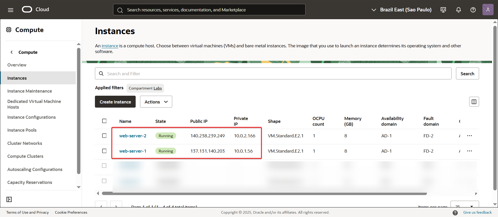
   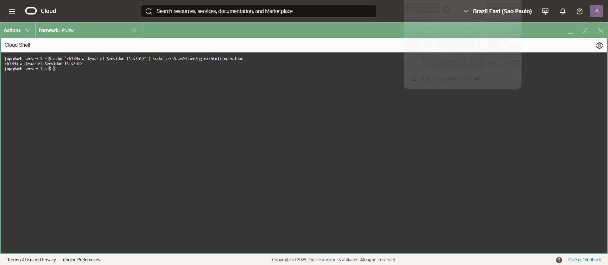
   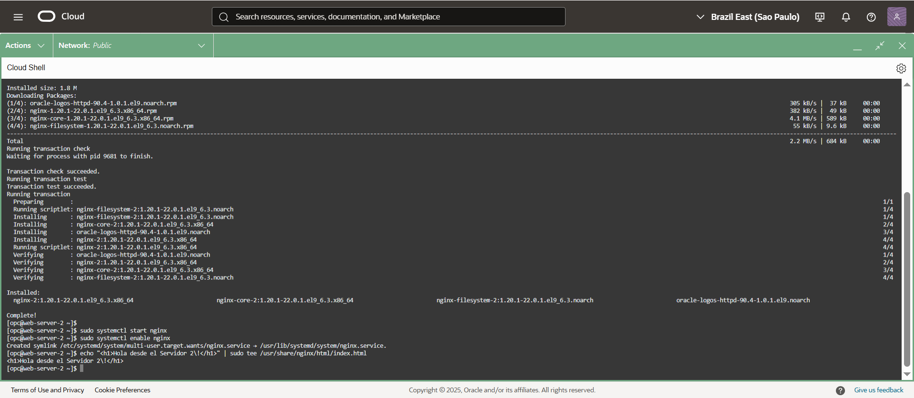
   
Paso 3: Crear el Balanceador de Carga
Crea el Balanceador de Carga Público:

Navega a Networking > Load Balancers.

Haz clic en "Create Load Balancer".

Nombre: lb-publico

Tipo: Public Load Balancer

Forma: Micro (es la opción más económica para este laboratorio).

Red de la VCN: Selecciona VCN-LB.

Subredes: Selecciona ambas subredes públicas (Subnet-LB-Publica-1 y Subnet-LB-Publica-2).   

IMPORTANTE: Deshabilita el firewall 
sudo systemctl stop firewalld

   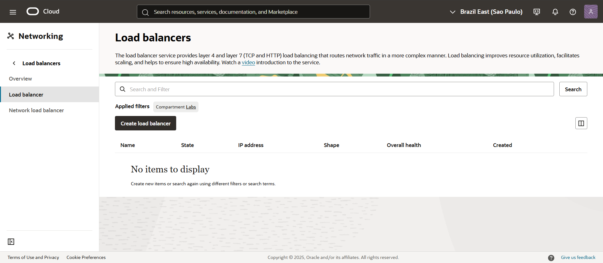
   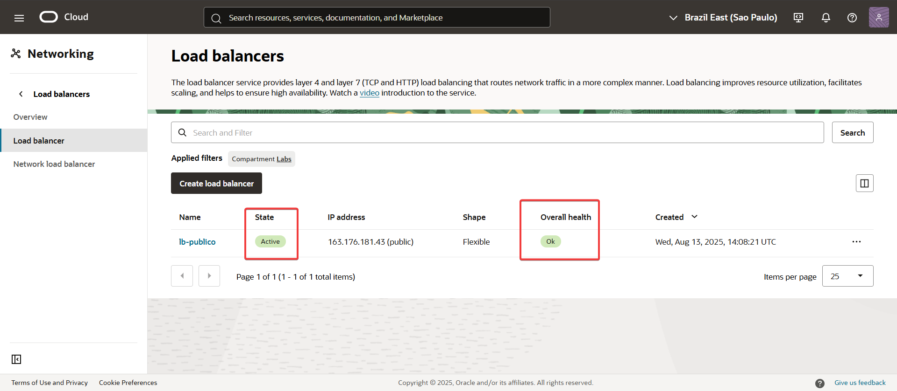
   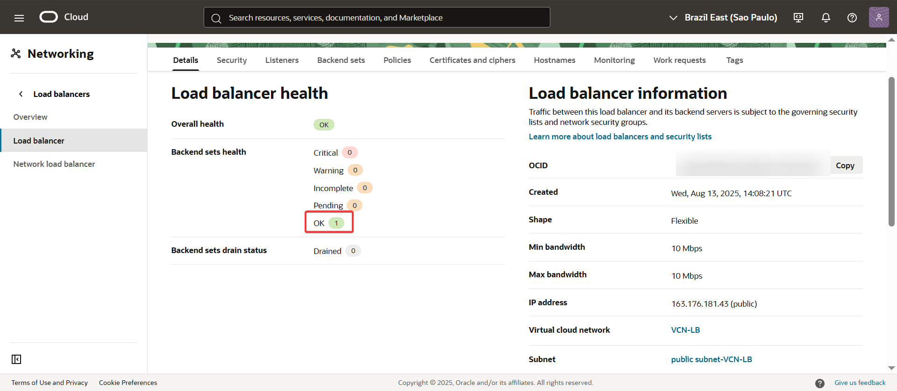
   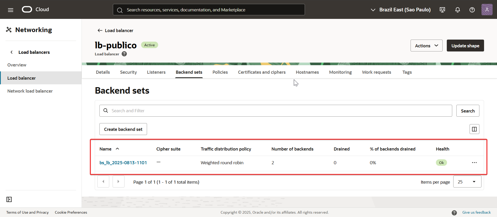   

Paso 4: Verificación (Mantener igual)
Una vez que el balanceador esté activo, prueba la IP Pública de tu balanceador en el navegador. Al recargar la página, verás que la respuesta alterna entre los dos servidores, demostrando que el balanceo de carga funciona correctamente entre las subredes.

IMPORTANTE:
En las Security Lists de Subnet-LB-Publica-1, debe existir una regla de entrada (Ingress) que permita el tráfico HTTP (puerto 80) desde internet. Si no existe, créala.

Tipo de Origen: CIDR

CIDR de Origen: 0.0.0.0/0 (para permitir el acceso desde cualquier lugar)

Protocolo IP: TCP

Puerto de Destino: 80

   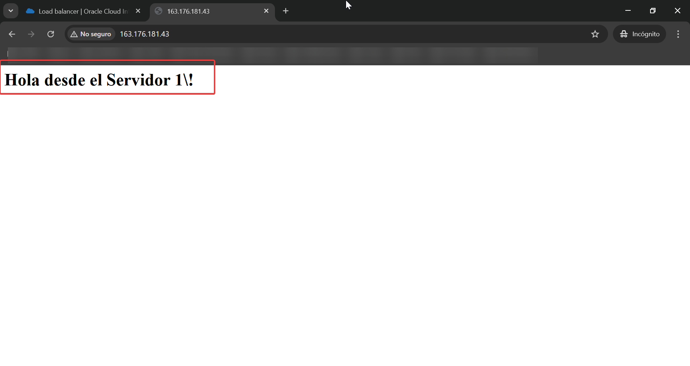
   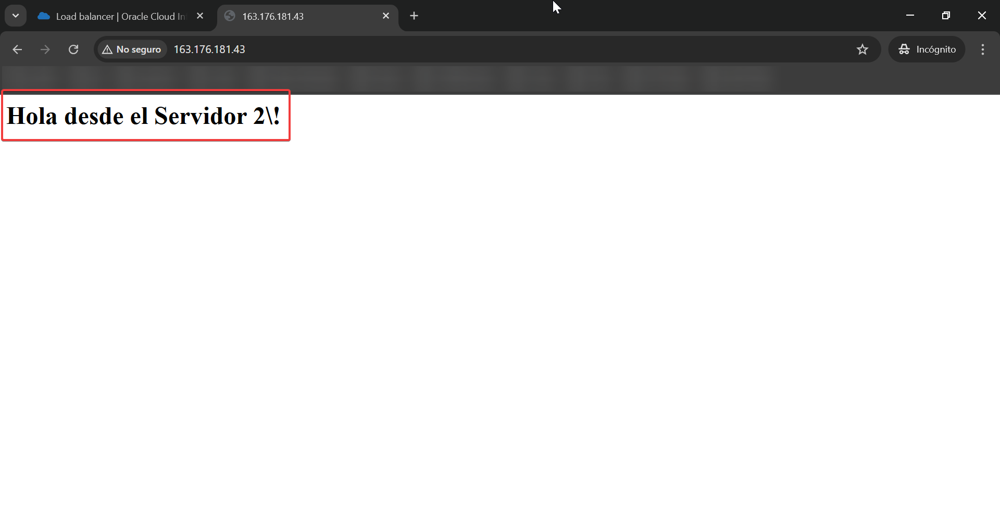
