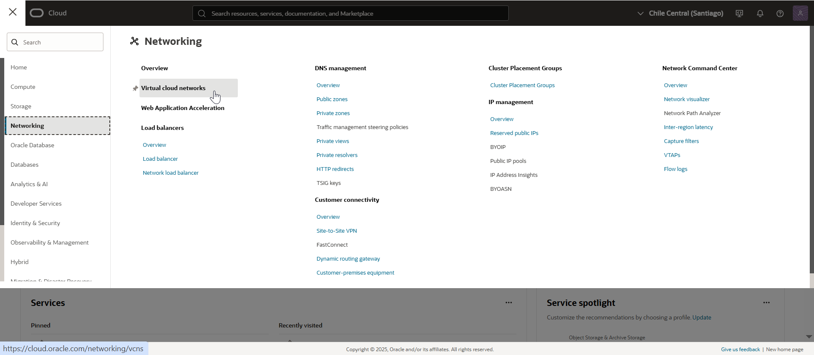
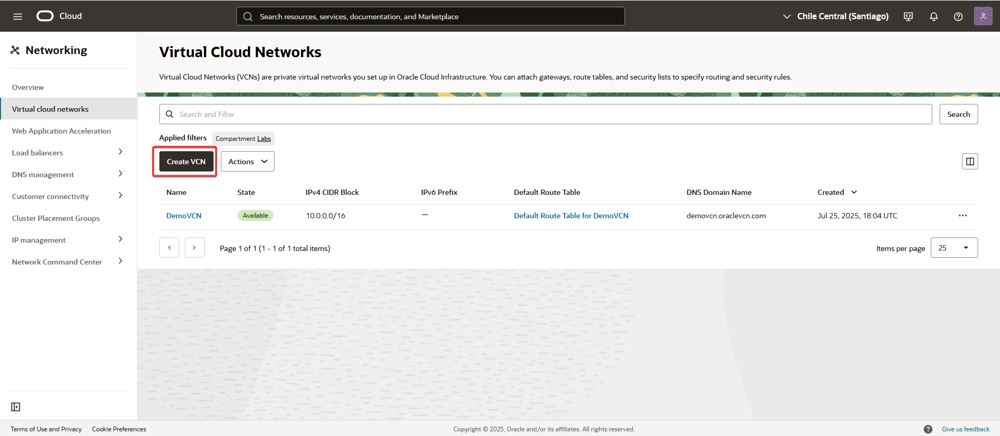
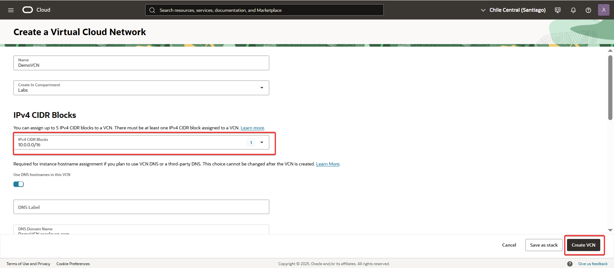

Create-a-VCN-Manually.md

🧩 Ejercicio : Crea una VCN manualmente
Este ejercicio te guiará a través del proceso para crear una Virtual Cloud Network (VCN) de forma manual en el compartimento Labs.

🔧 Pasos previos
No aplica.

---
## 🔍 Paso a paso

1.  Desde el menú de la consola, navega a Networking --> Virtual Cloud Networks.
	
   

2. En el compartimento Labs, haz clic en "Create VCN".

   

3. Completa el formulario con la información requerida y, luego, haz clic en "Create VCN".

   
