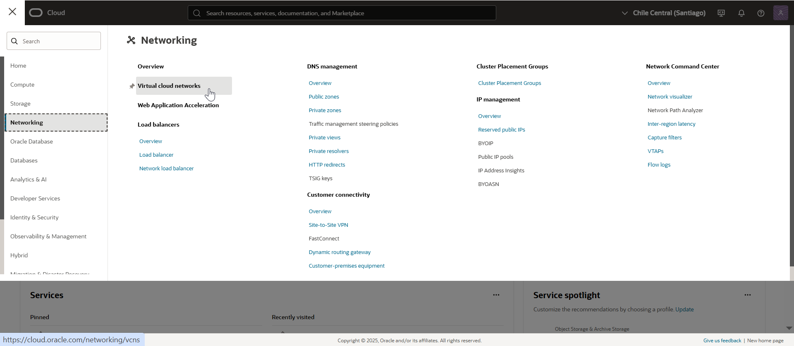
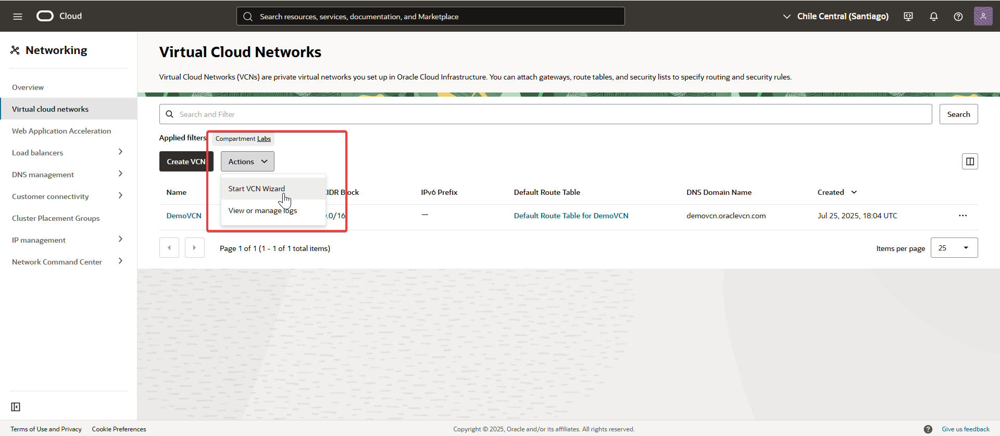
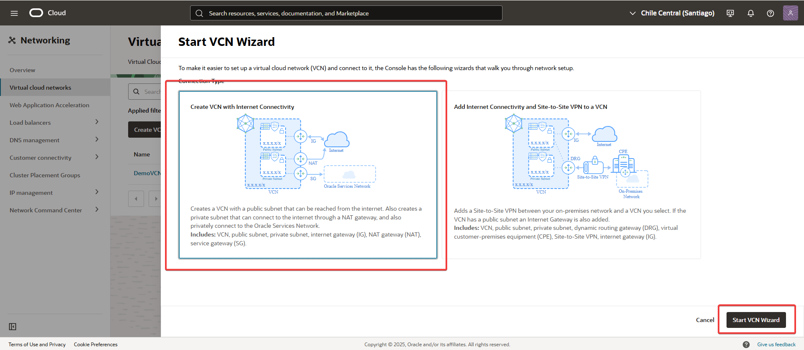
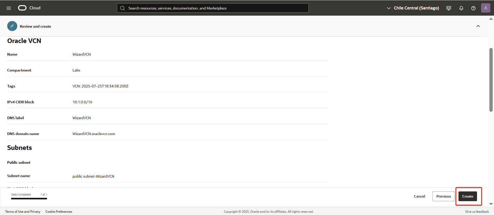

Create-a-VCN-Using-Wizard.md

🧩 Ejercicio : Crea una VCN usando el Asistente
Este ejercicio te mostrará cómo crear rápidamente una Virtual Cloud Network (VCN) utilizando el asistente de creación en el compartimento Labs.

🔧 Pasos previos
No aplica.

---
## 🔍 Paso a paso

1.  Desde el menú de la consola, navega a Networking --> Virtual Cloud Networks.
	
   

2. En el compartimento Labs, haz clic en "Actions" y selecciona "Start VCN Wizard".

   

3. Elige la opción "Create VCN with Internet Connectivity" y haz clic en "Start VCN Wizard" para continuar

   
   
4. Completa el formulario con la información solicitada y, finalmente, haz clic en "Create VCN".
   
   
