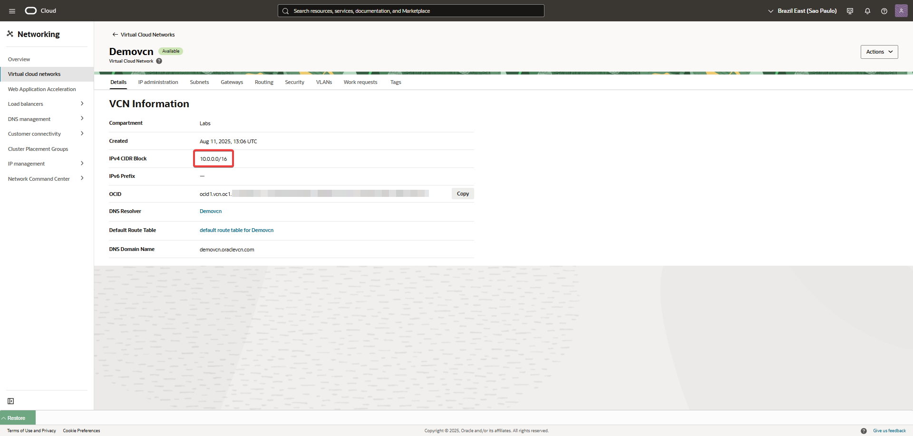
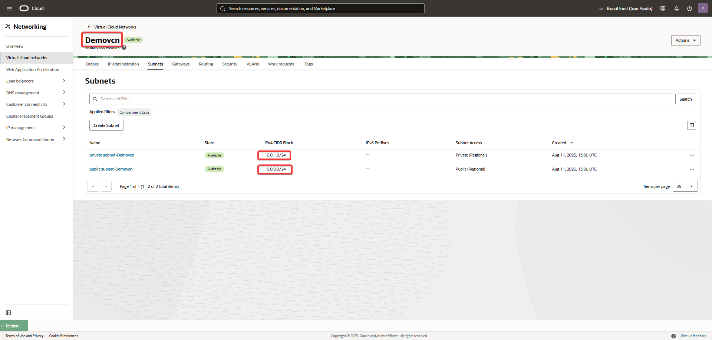
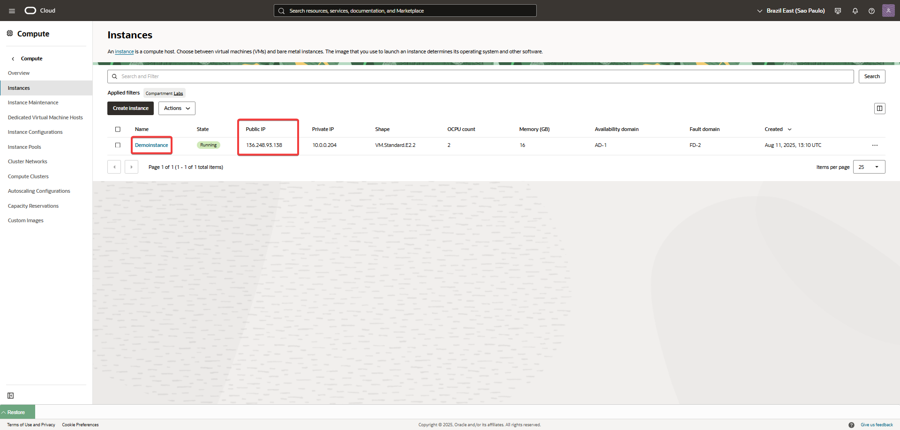
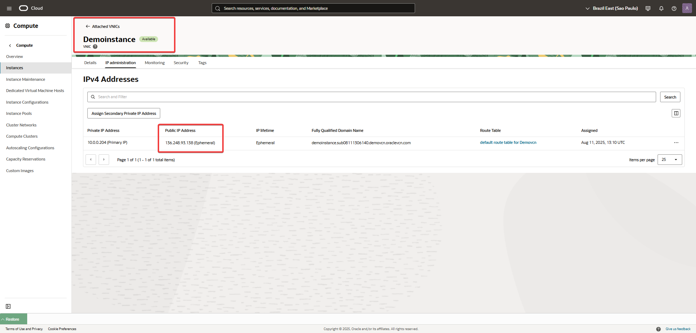
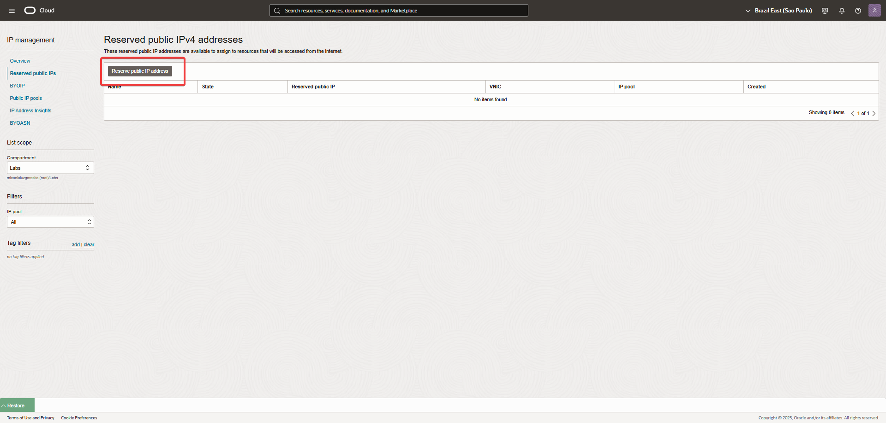
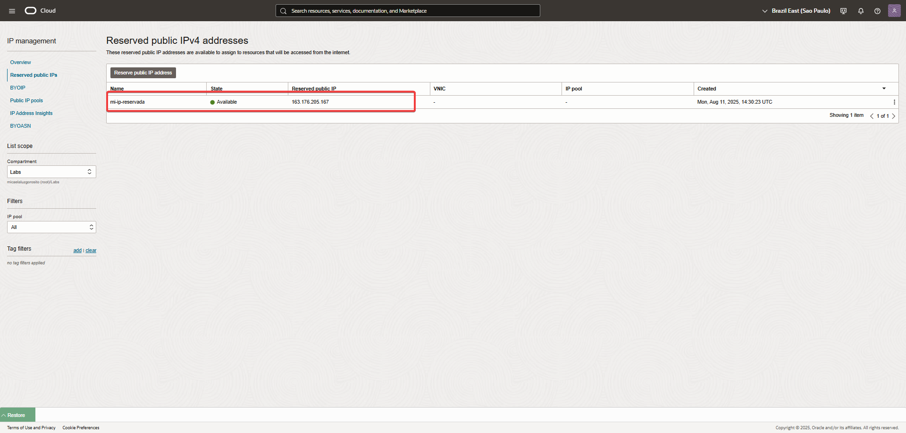
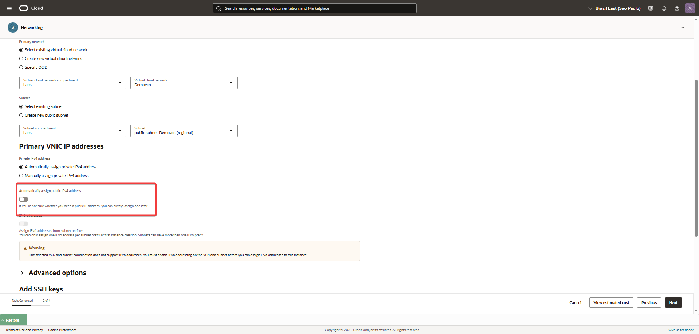
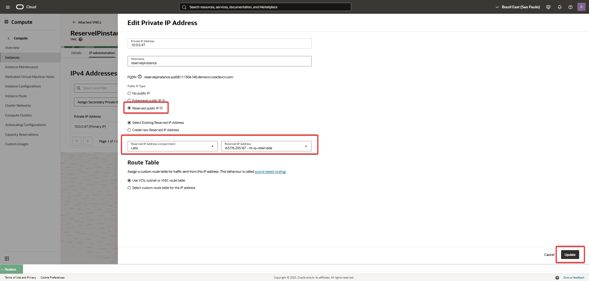
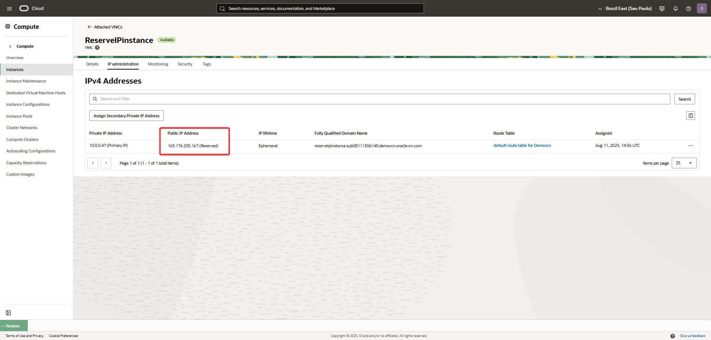

🛠️ Laboratorio de IP Management en OCI.

Gestión de IP Públicas Reservadas y Efímeras.
Este ejercicio te permitirá ver la diferencia de forma clara.

1- Configuración de red inicial:

Crea una VCN.

Crea una subred pública dentro de esa VCN, asegurándote de que tenga un Internet Gateway asociado para permitir la comunicación externa.

   
   
   

 
2- IP Pública Efímera (Prueba 1):

Lanza una instancia de cómputo en la subred pública.

En la configuración de red, selecciona la opción para "Assign a public IPv4 address".

Una vez que la instancia esté en estado "Running", anota su IP pública efímera.

Prueba: Termina (elimina) la instancia desde la consola de OCI. A continuación, crea una nueva instancia en la misma subred.

Observación: La nueva instancia tendrá una IP pública completamente diferente. Esto demuestra que la IP efímera es liberada y reasignada al eliminar el recurso.

   
   
   
   
3- IP Pública Reservada (Prueba 2):

Navega a Networking > IP Management > Reserved Public IPs.

Haz clic en "Reserve Public IP Address". Dale un nombre (ej. mi-ip-reservada) y selecciona tu compartimento. OCI creará una IP estática.

Lanza una tercera instancia de cómputo en la misma subred pública.

En la sección de red, NO marques la opción de asignar una IP pública.

Una vez que la instancia esté en estado "Running", ve a la VNIC de la instancia (haz clic en el nombre de la instancia y luego en el enlace de la VNIC).

Selecciona la IP privada principal y haz clic en "Edit". En la sección de IP pública, selecciona la opción para "Assign a reserved public IP" y elige mi-ip-reservada.

Prueba: Reinicia la instancia (desde la consola o el sistema operativo) y también termina y recrea una nueva instancia.

Observación: La IP reservada que creaste no cambiará. Incluso si la instancia se elimina, la IP reservada permanece en tu compartimento, lista para ser asignada a otro recurso, lo que demuestra su persistencia y reusabilidad.   

   
   
   
   
   
      
      
  
