🛠️ Laboratorio de Local VCN Peering en OCI
Objetivo: Conectar dos VCNs en la misma región para permitir la comunicación entre sus instancias de cómputo.
Diagrama de la arquitectura:
Paso 1: Configurar las VCNs y Subredes
Crea la primera VCN (Demovcn):

En la consola de OCI, navega a Networking > Virtual Cloud Networks.

Crea una VCN con el nombre Demovcn y el bloque CIDR 10.0.0.0/16.

Crea una subred pública con el bloque CIDR 10.0.1.0/24.

Crea la segunda VCN (Demovcn-B):

Crea una segunda VCN con el nombre Demovcn-B y el bloque CIDR 10.1.0.0/16. Es crucial que este CIDR no se superponga con el de Demovcn.

Crea una subred pública con el bloque CIDR 10.1.1.0/24.

   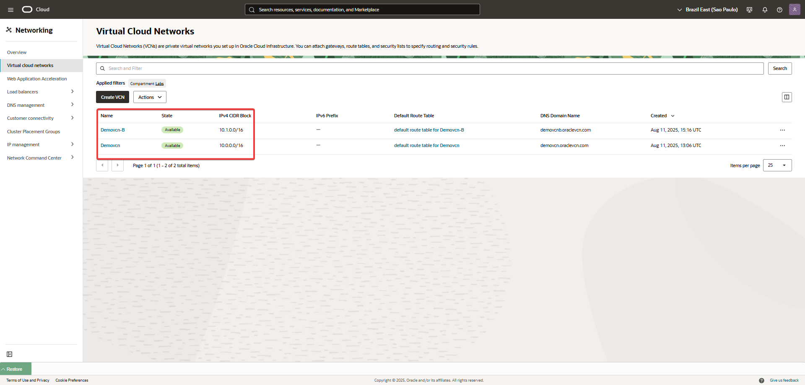

Paso 2: Crear el Local Peering Gateway (LPG)
Crea el LPG para Demovcn:

En la página de detalles de Demovcn, navega a Local Peering Gateways.

Haz clic en "Create Local Peering Gateway" y nómbralo LPG-A.

Crea el LPG para Demovcn-B:

Repite el mismo proceso en la página de detalles de Demovcn-B para crear LPG-B

   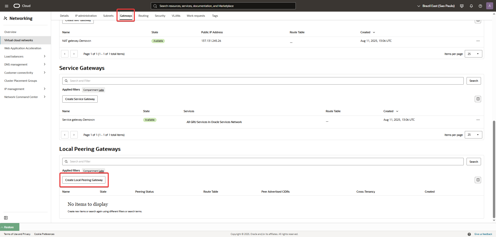
   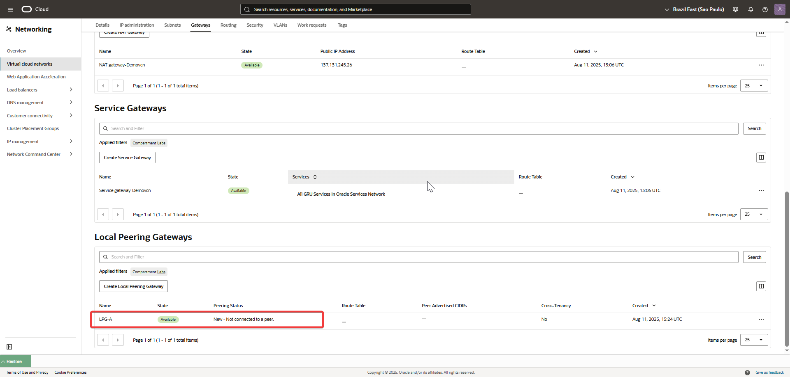
   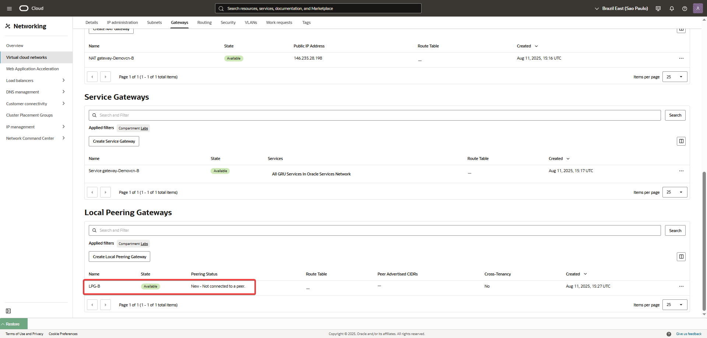
   
   
Paso 3: Establecer la conexión de Peering
Conecta los LPGs:

Desde la página de detalles de LPG-A, haz clic en "Establish Peering Connection".

Selecciona la VCN de destino (VCN-B) y el LPG de destino (LPG-B).

Ahora, la conexión de peering está configurada, pero aún no hay rutas para dirigir el tráfico.

   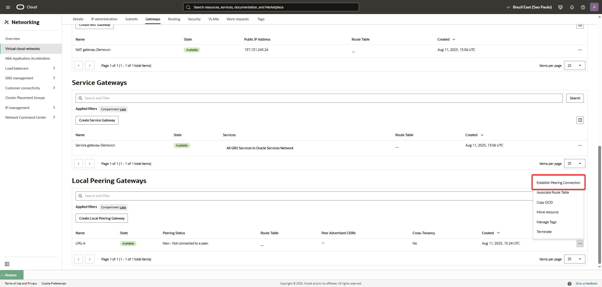
   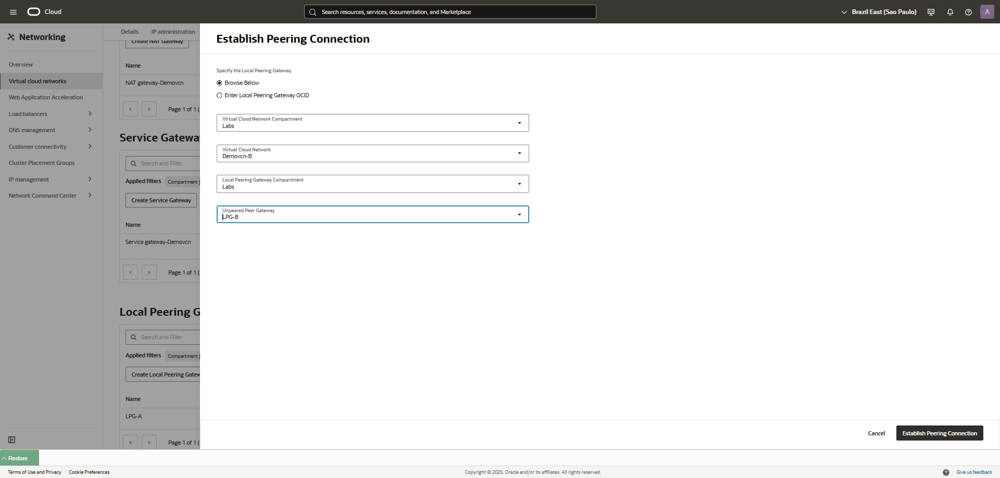
   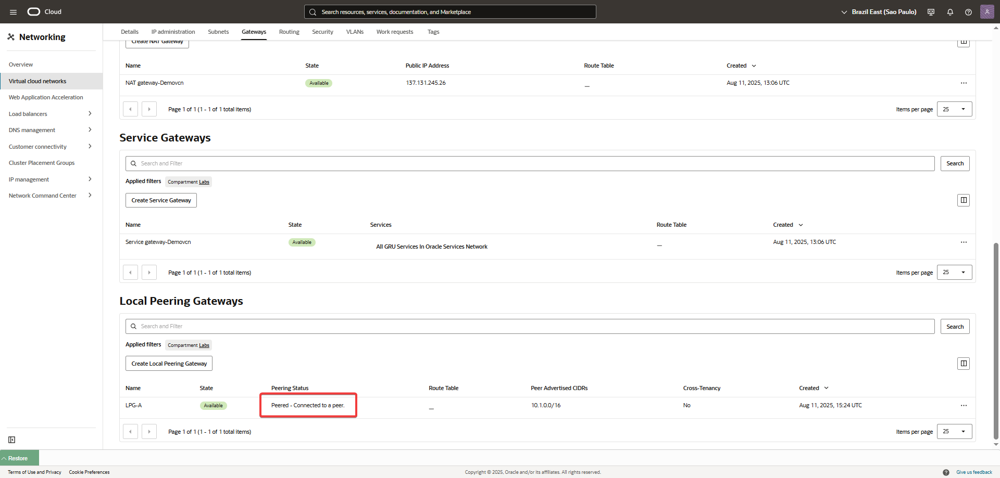
 
Paso 4: Actualizar las tablas de ruteo
Tabla de ruteo para Demovcn:

Navega a la tabla de ruteo de Subnet-A.

Agrega una nueva regla de ruta:

Tipo de destino: Local Peering Gateway.

CIDR de destino: 10.1.0.0/16 (el CIDR completo de Demovcn-B).

Target Local Peering Gateway: LPG-A.

Tabla de ruteo para Demovcn-B:

Navega a la tabla de ruteo de Subnet-B.

Agrega una nueva regla de ruta:

Tipo de destino: Local Peering Gateway.

CIDR de destino: 10.0.0.0/16 (el CIDR completo de Demovcn).

Target Local Peering Gateway: LPG-B.   

   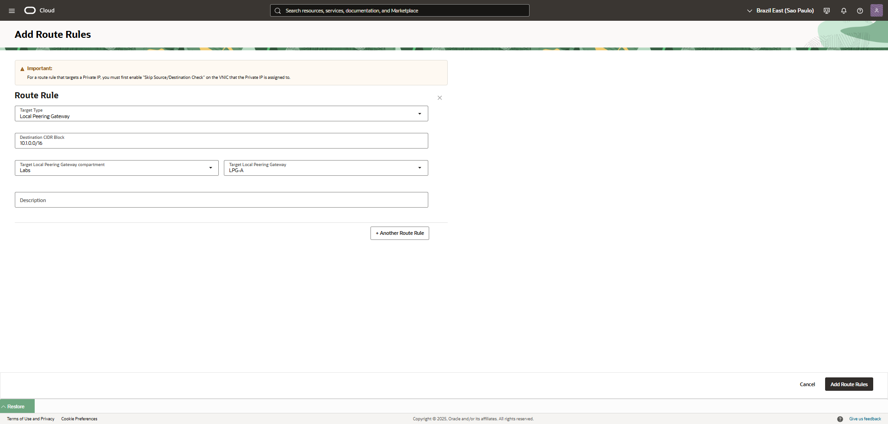
   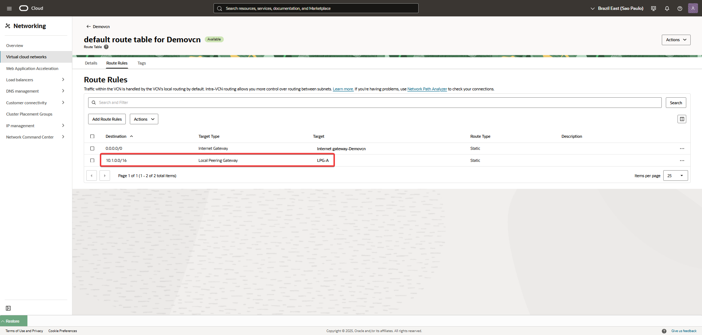
   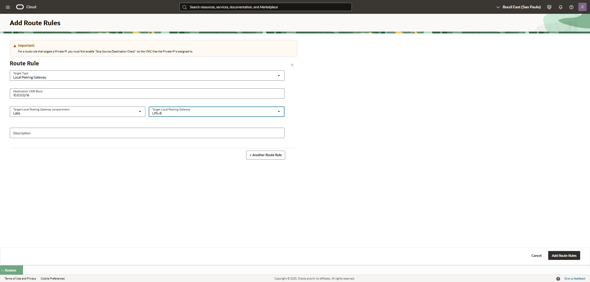
   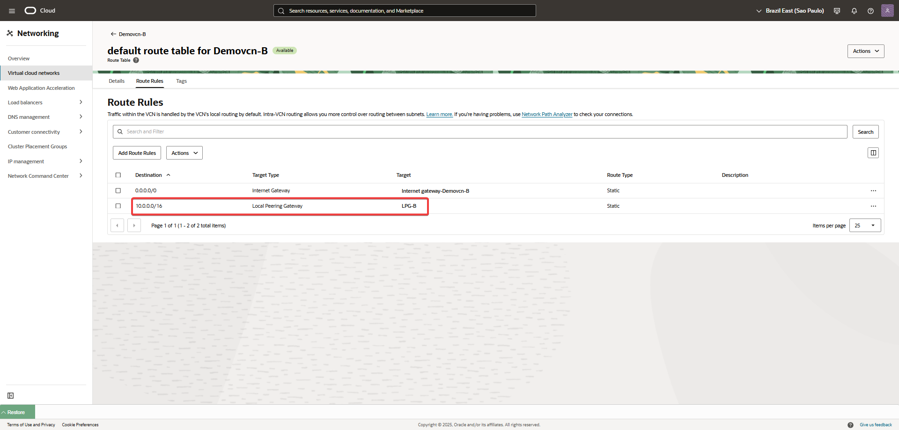   

Paso 5: Configurar las Listas de Seguridad (Security Lists)
Lista de seguridad para Subnet-A:

En la lista de seguridad de Subnet-A, agrega una regla de entrada (ingress) que permita la comunicación desde Demovcn-B.

Tipo de origen: CIDR.

CIDR de origen: 10.1.0.0/16.

Protocolo IP: ICMP (para permitir el ping).

Agrega una regla de salida (egress) que permita la comunicación hacia Demovcn-B.

Tipo de destino: CIDR.

CIDR de destino: 10.1.0.0/16.

Protocolo IP: ICMP.

Lista de seguridad para Subnet-B:

Repite el mismo proceso, pero esta vez configurando las reglas para Subnet-B y usando el CIDR de Demovcn (10.0.0.0/16).   

   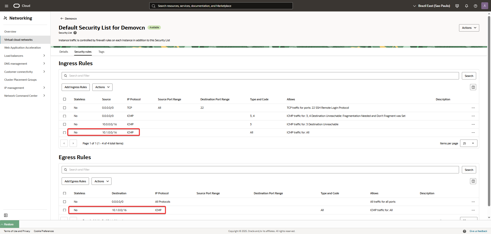
   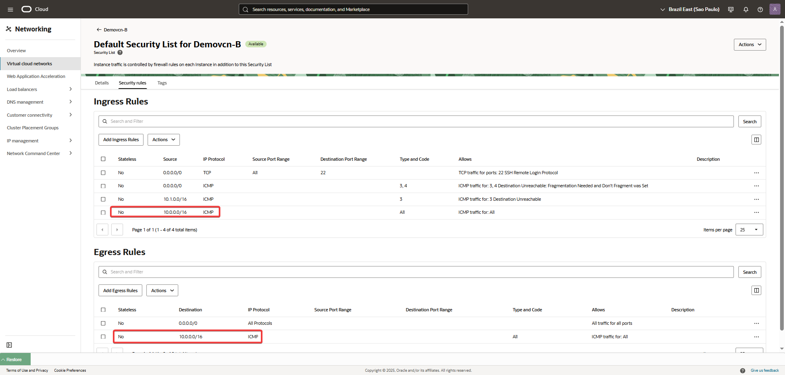
   
Paso 6: Lanzar instancias y probar la conexión
Lanza las instancias de cómputo:

Crea una instancia en Subnet-A.

Crea otra instancia en Subnet-B.

Prueba la conectividad:

Desde la instancia en Subnet-A, haz un ping a la IP privada de la instancia en Subnet-B.

Si todo está configurado correctamente, el ping será exitoso, demostrando que el Local VCN Peering está funcionando.   

   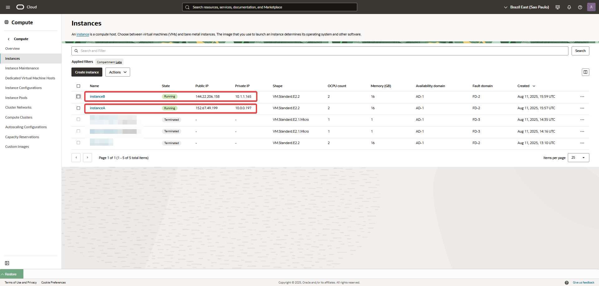
   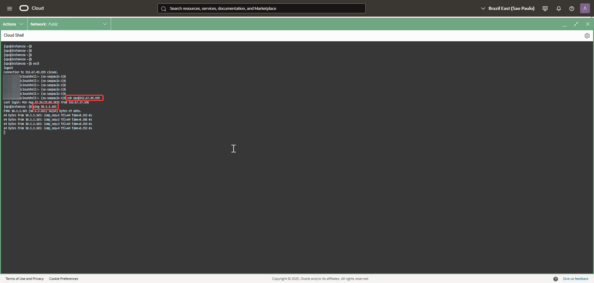
