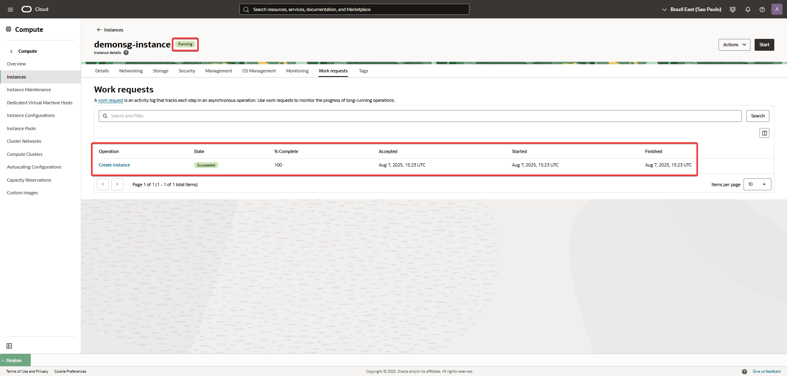

Guía para la Configuración de un Network-Security-Group.
Este instructivo te guiará a través de la configuración de un Network-Security-Group
---
## Paso a paso

1. Crear VCN manualmente.  
   Este laboratorio asume que ya tenés una VCN creada manualmente.  
   Si necesitás crearla, podés seguir los pasos en el siguiente laboratorio:  
   [Crear una VCN manualmente](../Create-a-VCN-Manually/Create-a-VCN-Manually.md)

2. Creación de una subred pública
Dentro de la VCN que creaste en el paso anterior, configura una subred pública. Si necesitas ayuda con este paso, consulta el siguiente laboratorio: 
   [Crear una VCN manualmente](../Subnet-Public/Subnet-Public.md)
   
3. Configuración de un Network Security Group (NSG)
Dentro de la misma VCN, crea un Network Security Group.

   
   
   
4. Crear una instancia de cómputo
Crea una instancia de cómputo en tu VCN.
   
    
   
   
      

5. Instalar y configurar el servidor web Apache
En la instancia de cómputo que creaste, instala el servidor web Apache y crea un archivo index.html de prueba.
   
   
      
   
6. Asociar el NSG a la instancia
Asocia el Network Security Group que creaste en el paso 3 a la instancia de cómputo.

   
      
   
7- Verificar el funcionamiento del laboratorio
Copia la IP pública de tu instancia y pégala en el navegador de tu conexión local. Deberías ver el mensaje: "This is a compute demo test page".

   
