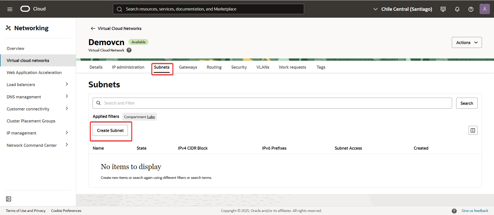
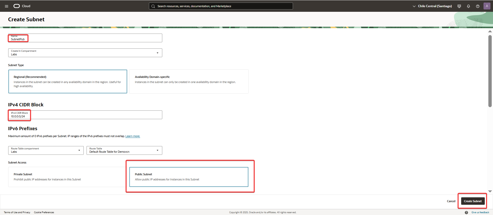
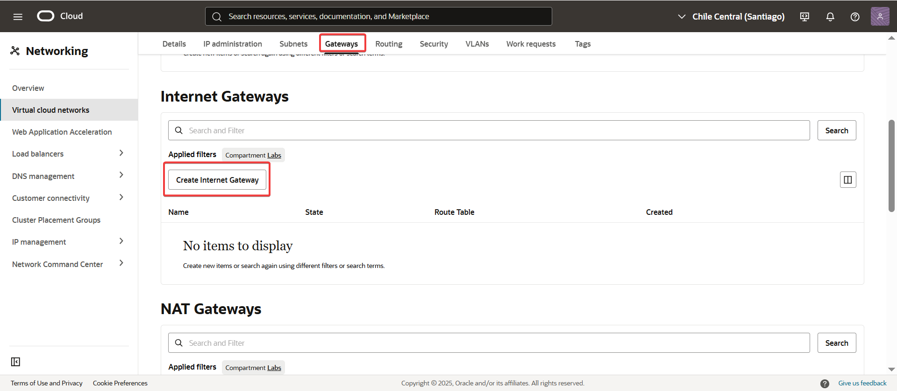
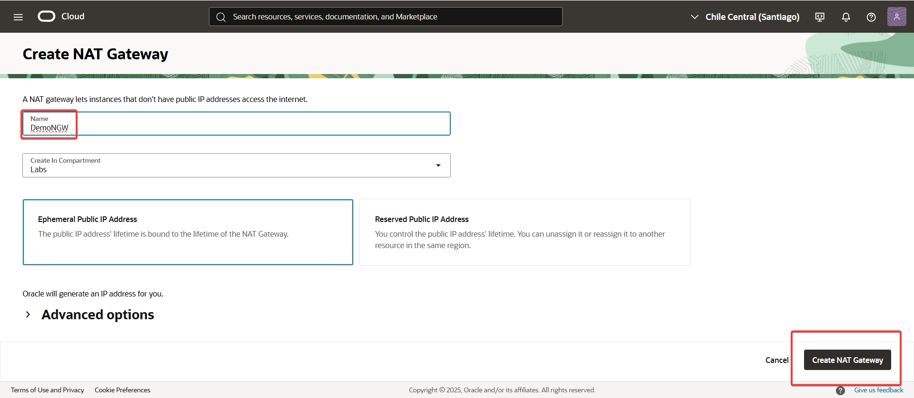
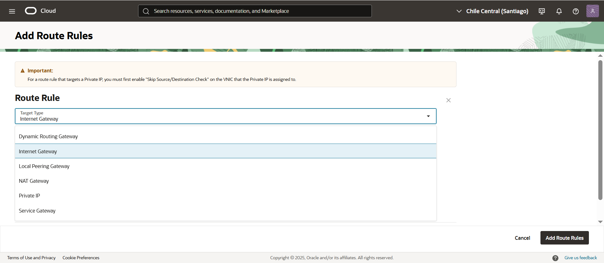
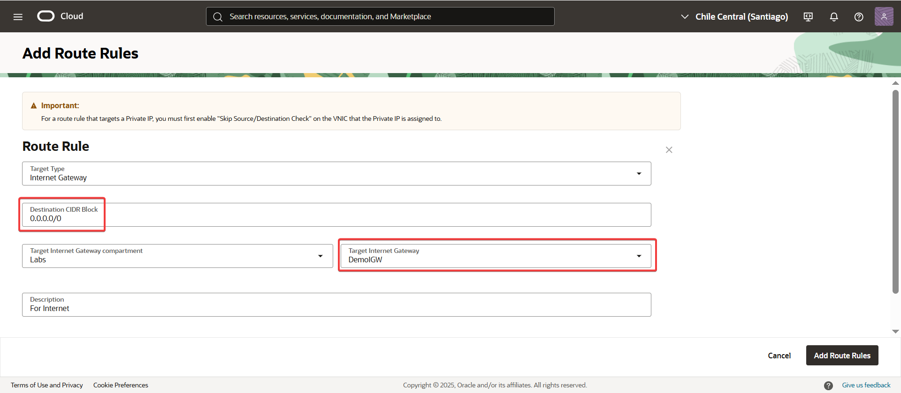
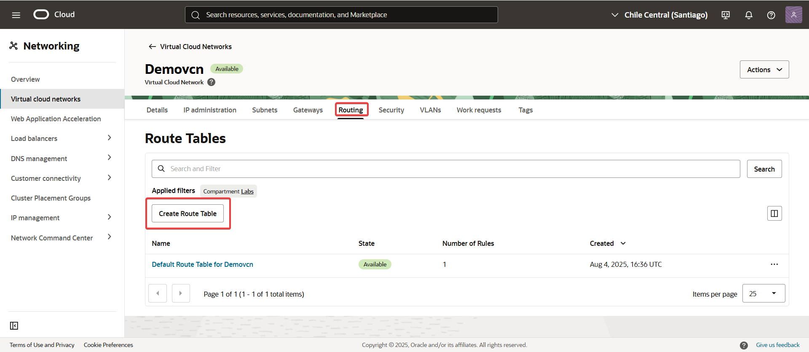
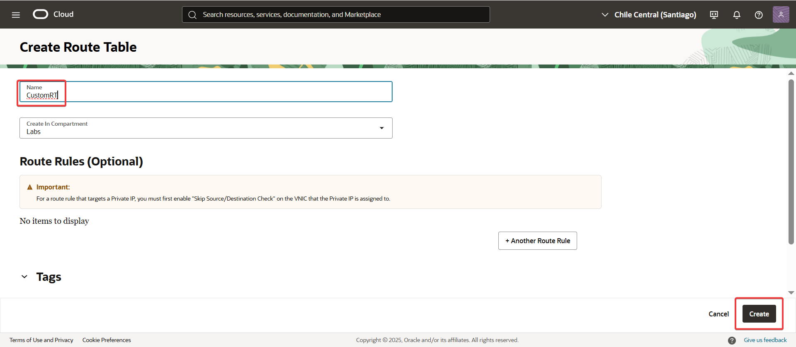
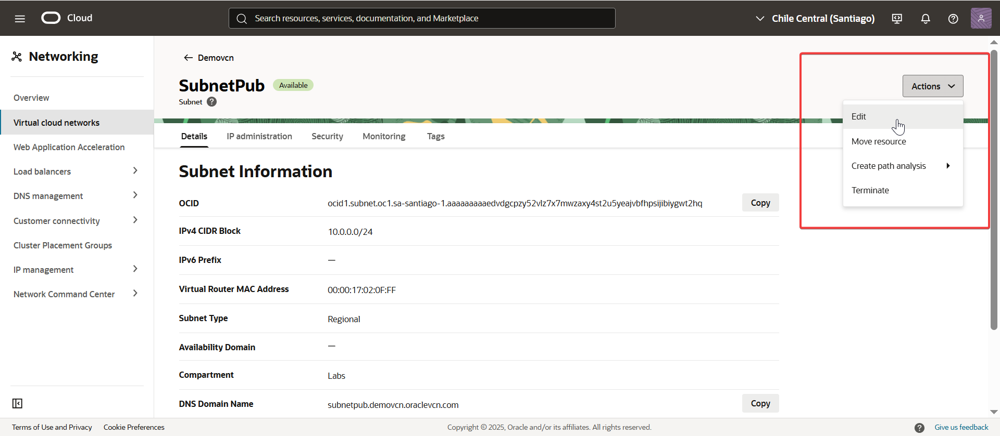
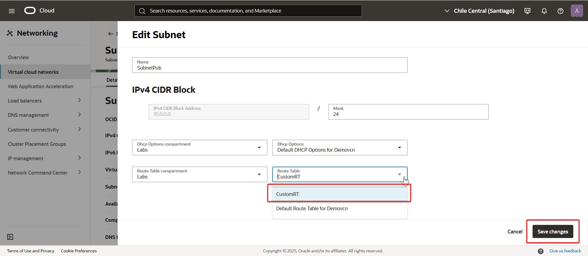

Este ejercicio te mostrará cómo trabajar con tablas de rutas (Route Tables) en Oracle Cloud Infrastructure. Aprenderás a:

Crear una nueva tabla de rutas.

Agregar reglas de ruteo.

Asociar la tabla a una subnet específica.

---
## Paso a paso

1. Crear VCN manualmente.  
   Este laboratorio asume que ya tenés una VCN creada manualmente.  
   Si necesitás crearla, podés seguir los pasos en el siguiente laboratorio:  
   👉 [Crear una VCN manualmente](../Create-a-VCN-Manually/Create-a-VCN-Manually.md)

2. Crear una subnet pública en la VCN creada manualmente en el paso 1.

   
   

3. Crear un Internet Gateway en la misma VCN.

   
   
   
4. Agregar una regla de ruteo a la tabla de rutas por defecto (Default Route Table) de la VCN.
   
   
   
   

5. Crear una nueva tabla de rutas (Route Table).
   
   
      
   
6. Asociar la nueva tabla de rutas creada en el paso 5 a la subnet creada en el paso 2.

   
      
