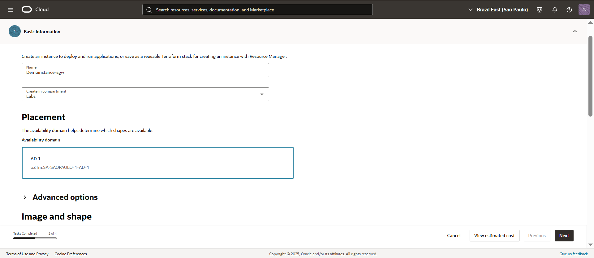
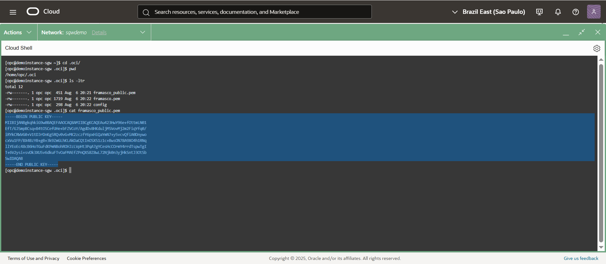
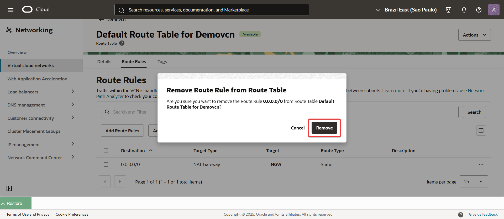
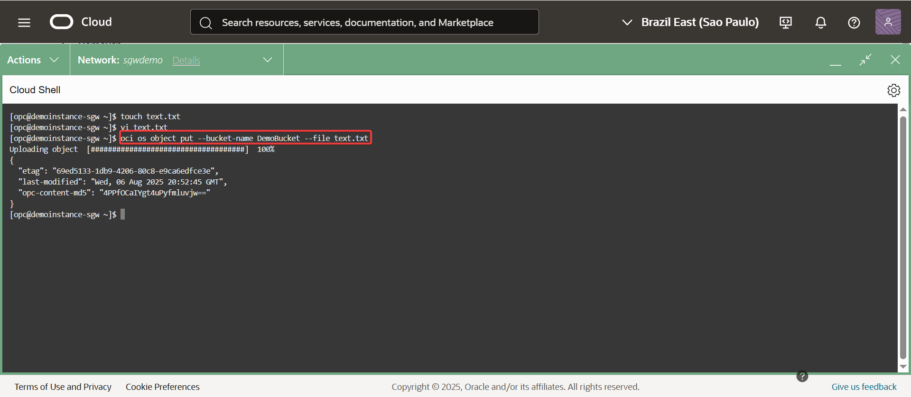

Guía para la Configuración de un Service Gateway en Oracle Services Network 🌐 
Este instructivo te guiará a través de la configuración de un Service Gateway, una herramienta esencial para conectar tu red virtual (VCN) con los servicios de Oracle de manera segura y eficiente.
---
## Paso a paso

1. Crear VCN manualmente.  
   Este laboratorio asume que ya tenés una VCN creada manualmente.  
   Si necesitás crearla, podés seguir los pasos en el siguiente laboratorio:  
   ?? [Crear una VCN manualmente](../Create-a-VCN-Manually/Create-a-VCN-Manually.md)

2. Creación de una subred privada
En la VCN que creaste en el paso anterior, configura una subred privada.

   
   

3. Configuración de un Service Gateway
Dentro de la misma VCN, crea un Service Gateway.

   
   
   
4. Configuración de un NAT Gateway
Añade un NAT Gateway a tu VCN.
   
      

5. Actualización de la tabla de rutas por defecto
Accede a la tabla de rutas por defecto (Route Table Default) de tu VCN y agrega una regla para enrutar el tráfico a través del NAT Gateway que creaste en el paso 4.
   
   
      
   
6. Creación de un Bucket en Object Storage
Procede a crear un Bucket en el servicio de Object Storage.

   
      
   
7- Creación de una instancia
Crea una nueva instancia asociándola al Service Gateway que configuraste en el paso 3.

   
   
   
   
   
      
         
   
8- Creación de una definición de red privada
Configura una Private Network definition list.

   
   
      
   
9- Conexión a la instancia vía SSH
Una vez que la conexión esté establecida, conéctate a la instancia utilizando SSH a través de su IP privada.

   
   
10- instalar CLI de OCI Configurarlo.
bash -c "$(curl -L https://raw.githubusercontent.com/oracle/oci-cli/master/scripts/install/install.sh)"

   
   
   
   
   
   
11- Interactuar con el Bucket desde la instancia.

Eliminamos la entrada del NAT en el Route Table Default.
     

Agregamos el SGW (Service Gateway) al Route Table Default.
     

Creamos un archivo text.txt desde la instancia en el Bucket creado en el punto 6.
oci os object put --bucket-name DemoBucket --file text.txt
        
   
