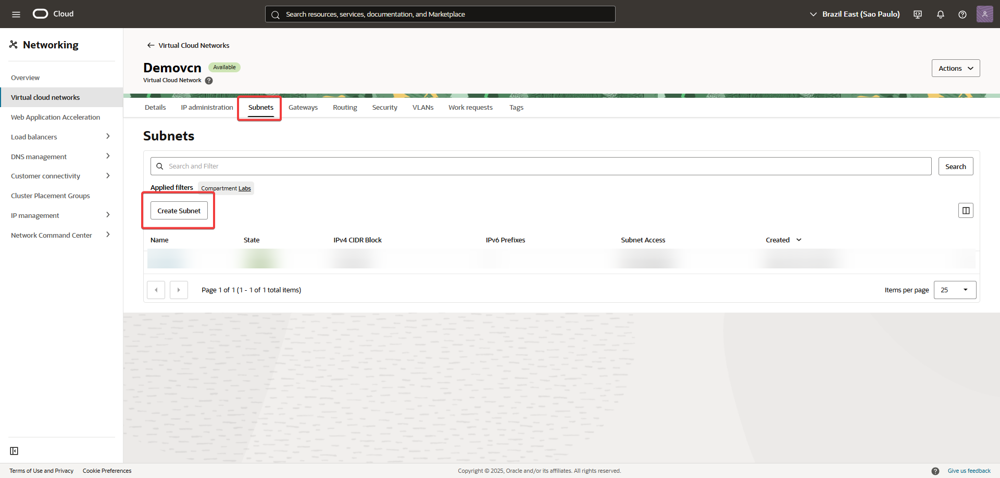
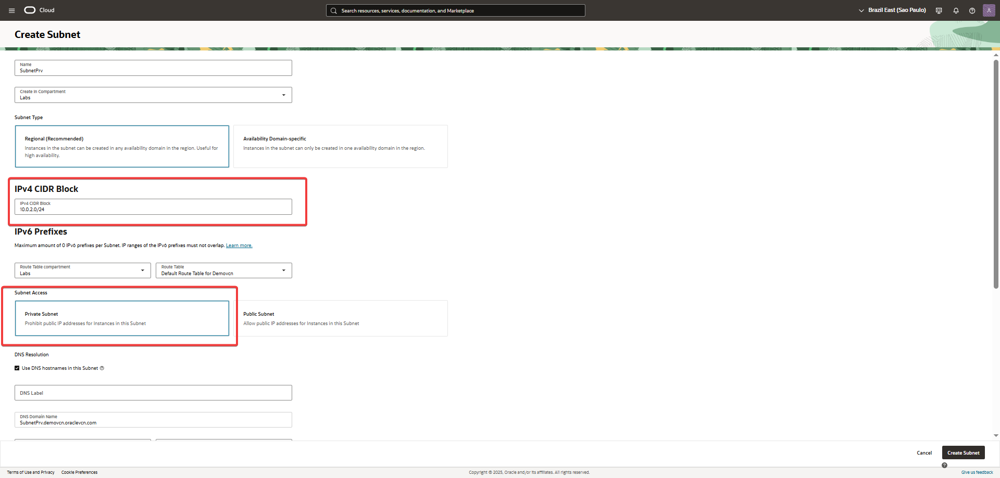
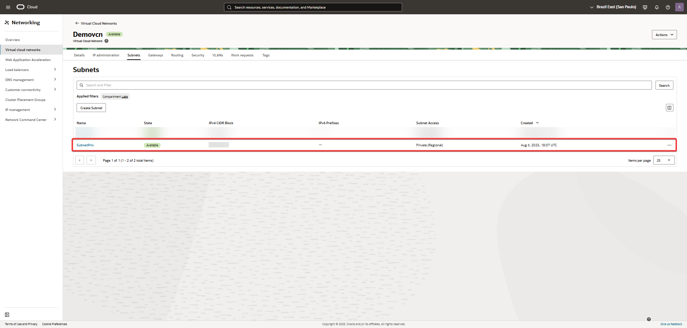

Guía para la Configuración de una Subnet-Priv.
Este instructivo te guiará a través de la configuración de una Subnet-Priv
---
## Paso a paso

1. Crear VCN manualmente.  
   Este laboratorio asume que ya tenés una VCN creada manualmente.  
   Si necesitás crearla, podés seguir los pasos en el siguiente laboratorio:  
   ?? [Crear una VCN manualmente](../Create-a-VCN-Manually/Create-a-VCN-Manually.md)

2. Creación de una subred privada
En la VCN que creaste en el paso anterior, configura una subred privada.

   
   
   
